### 矩阵 

链接:
[note/1C429D1F-388F-4A33-AD18-CF6A4B09A72B](marginnote4app://note/1C429D1F-388F-4A33-AD18-CF6A4B09A72B)\
`<html xmlns="http://www.w3.org/1999/xhtml">`{=html}`<head>`{=html}`<meta http-equiv="Content-Type" content="text/html; charset=UTF-8" />`{=html}`</head>`{=html}`<body />`{=html}`</html>`{=html}

#### 逆 

链接:
[note/C6838F06-2679-48BB-90C9-E161EB624621](marginnote4app://note/C6838F06-2679-48BB-90C9-E161EB624621)\
`<html xmlns="http://www.w3.org/1999/xhtml">`{=html}`<head>`{=html}`<meta http-equiv="Content-Type" content="text/html; charset=UTF-8" />`{=html}`</head>`{=html}`<body />`{=html}`</html>`{=html}

##### 具体矩阵求逆 

链接:
[note/20A84803-D16D-4D96-B471-63DB037B7A84](marginnote4app://note/20A84803-D16D-4D96-B471-63DB037B7A84)\
`<html xmlns="http://www.w3.org/1999/xhtml">`{=html}`<head>`{=html}`<meta http-equiv="Content-Type" content="text/html; charset=UTF-8" />`{=html}`</head>`{=html}`<body />`{=html}`</html>`{=html}

###### 1988数三  {#1988数三-3}

\
链接:
[note/708C47BE-7750-4CDC-97BC-20B24DBD5CEF](marginnote4app://note/708C47BE-7750-4CDC-97BC-20B24DBD5CEF)\
0001 0010 设矩阵A= ,则A\'= 0100 10 00\

###### 1989数一  {#1989数一}

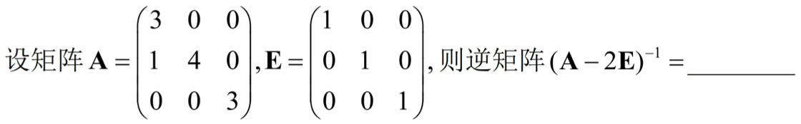\
链接:
[note/05BF91EF-4C6D-4215-9397-FB93D55681A9](marginnote4app://note/05BF91EF-4C6D-4215-9397-FB93D55681A9)\
300/100 设矩阵A=140,E=010,则逆矩阵(A-2E)= 003001\

###### 1991数一  {#1991数一}

\
链接:
[note/9C544B46-4553-445C-833F-641972DE5F38](marginnote4app://note/9C544B46-4553-445C-833F-641972DE5F38)\
5200 2100 设4阶方阵A= ,则A的逆矩阵A= 001-2 001\

###### 1994数三  {#1994数三}

\
链接:
[note/89B39F50-734D-4041-8690-544ED7153265](marginnote4app://note/89B39F50-734D-4041-8690-544ED7153265)\
「o4001 00a. -0 设4=:日3 ,其中a,≠0,i=1,2,...,n,则4= 000a1 L4,00. 0\

###### 1995数三  {#1995数三}

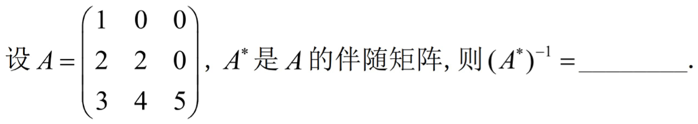\
链接:
[note/12FDB764-9B0C-4FBB-BFBB-6B34D2ECDAAB](marginnote4app://note/12FDB764-9B0C-4FBB-BFBB-6B34D2ECDAAB)\
(100 设4=220,4是4的伴随矩阵,则(4)\'= 345\

###### 25版880矩阵基础解答3  {#25版880矩阵基础解答3}

\
链接:
[note/F37EBEB2-A5E8-4898-91C4-457A5051BE92](marginnote4app://note/F37EBEB2-A5E8-4898-91C4-457A5051BE92)\
设A\

##### 抽象逆相关 

链接:
[note/2AEFDF91-2A07-4FDE-A6BD-E3F4B3190795](marginnote4app://note/2AEFDF91-2A07-4FDE-A6BD-E3F4B3190795)\
`<html xmlns="http://www.w3.org/1999/xhtml">`{=html}`<head>`{=html}`<meta http-equiv="Content-Type" content="text/html; charset=UTF-8" />`{=html}`</head>`{=html}`<body />`{=html}`</html>`{=html}

###### 2000数二  {#2000数二}

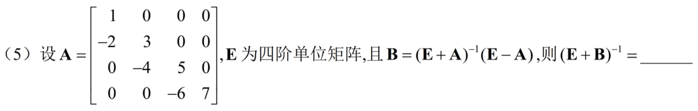\
链接:
[note/3D6BA6EF-2AF1-4EAC-A55F-3F8CE8FE645E](marginnote4app://note/3D6BA6EF-2AF1-4EAC-A55F-3F8CE8FE645E)\
「1000 2300 (5)设A=0450,E为四阶单位矩阵,且B=(E+A)\'(E-A),则(E+B)\'=
00-67\

###### 25版880矩阵综合解答2  {#25版880矩阵综合解答2}

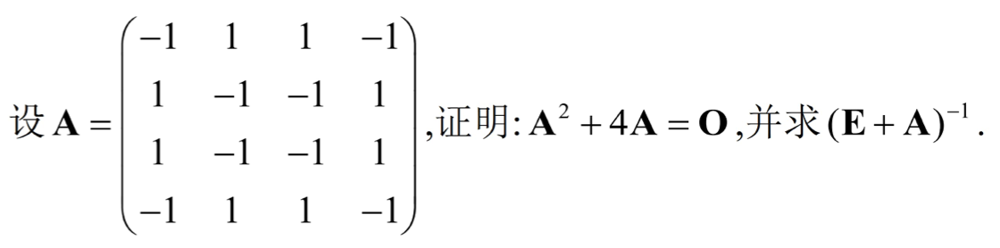\
链接:
[note/628A9EA0-78BE-4899-B8DC-ED0A136BFBEF](marginnote4app://note/628A9EA0-78BE-4899-B8DC-ED0A136BFBEF)\
,证明:A2+4A=O,并求(E+A)\'. -1-11\

###### 25版880矩阵基础解答4  {#25版880矩阵基础解答4}

\
链接:
[note/6A3C9094-63E8-48EB-ABDA-667420C1CCC9](marginnote4app://note/6A3C9094-63E8-48EB-ABDA-667420C1CCC9)\
(211 设A=121,证明:A2=5A-4E,并求A'112\

###### 姜晓千基础例题  {#姜晓千基础例题-11}

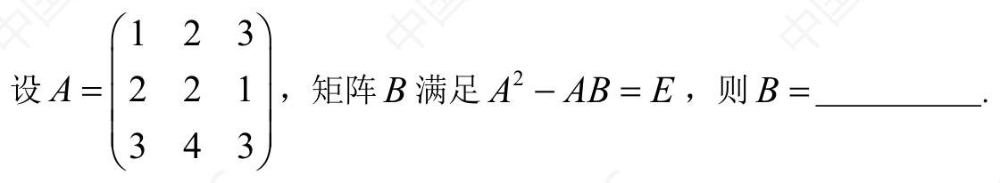\
链接:
[note/D712894A-2B79-4C9B-9656-6B410B9AB6E3](marginnote4app://note/D712894A-2B79-4C9B-9656-6B410B9AB6E3)\
123 22 1 343 A B 2AABE B . C 中国C 中国中国\

###### 25版880矩阵综合填空4  {#25版880矩阵综合填空4}

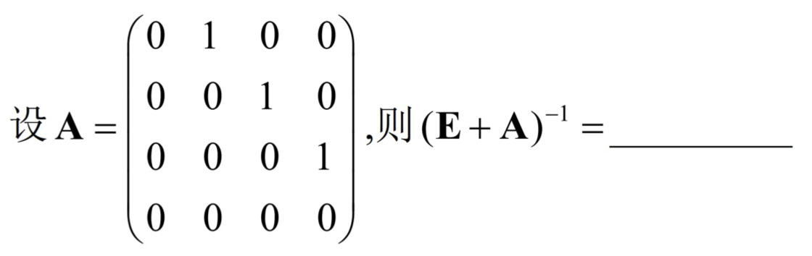\
链接:
[note/D1788D2D-8126-4EE5-BD21-33AB0840FC3E](marginnote4app://note/D1788D2D-8126-4EE5-BD21-33AB0840FC3E)\
0100 0010 设A= ,则(E+A)= 0001 0000\

###### 2001数一  {#2001数一}

\
链接:
[note/36A0FBB0-200E-42C0-9FC3-29FED1A845DE](marginnote4app://note/36A0FBB0-200E-42C0-9FC3-29FED1A845DE)\
n A 2 4 AAEO 1 ( )A E . C OOC OOC\

###### 25版880矩阵基础填空10  {#25版880矩阵基础填空10}

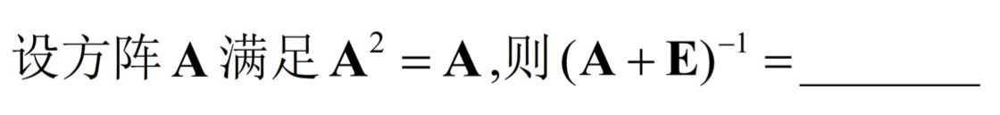\
链接:
[note/C37688F8-7272-4037-A2FE-98BC113163EA](marginnote4app://note/C37688F8-7272-4037-A2FE-98BC113163EA)\
)设方阵A满足A\'=A,则(A+E)"=\

###### 25版880矩阵基础填空9  {#25版880矩阵基础填空9}

\
链接:
[note/08BB9042-C3C5-4D5D-86DF-465F373FE361](marginnote4app://note/08BB9042-C3C5-4D5D-86DF-465F373FE361)\
设方阵A满足A-3A-2E=O,则A\'=\

###### 25版880矩阵基础填空7  {#25版880矩阵基础填空7}

\
链接:
[note/242B7C19-6F3A-4E95-9B2A-B424B3324EDF](marginnote4app://note/242B7C19-6F3A-4E95-9B2A-B424B3324EDF)\
若A\'=O.n为正整数,则(E-A)\'=\

###### 2003数三; 25版880矩阵基础填空13  {#2003数三-25版880矩阵基础填空13}

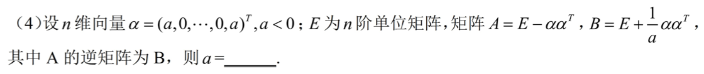\
链接:
[note/90B3B48B-F155-4118-960D-A556AFFD66E7](marginnote4app://note/90B3B48B-F155-4118-960D-A556AFFD66E7)\
1 (4)设n维向量a=(a.0...,0,a),a\<0;E为n阶单位矩阵,矩阵4=E-au,B=E+-aa,
其中A的逆矩阵为B,则a=\

###### 2022数一  {#2022数一}

\
链接:
[note/4FF96121-BAFD-40A4-B08A-A7EF3721412A](marginnote4app://note/4FF96121-BAFD-40A4-B08A-A7EF3721412A)\
2.42022 n AEA B 1 (( ) ) EEABA BA . MOOC MOOC MOOC\

###### 25版880矩阵基础解答5  {#25版880矩阵基础解答5}

\
链接:
[note/357B51C3-92EB-405B-9224-0794C726743E](marginnote4app://note/357B51C3-92EB-405B-9224-0794C726743E)\
设方阵A,B满足\|BzO.(A-E)\'=(B-E)\',求A(用B表示). \

###### 25版880矩阵基础解答6  {#25版880矩阵基础解答6}

\
链接:
[note/1CF9E542-8F62-4F49-84F8-78711ADC2002](marginnote4app://note/1CF9E542-8F62-4F49-84F8-78711ADC2002)\
/100 设A=230,B=(E+A)\'(E-A),求\[E+B7 045\

###### 25版880矩阵基础解答7  {#25版880矩阵基础解答7}

\
链接:
[note/36867164-6930-40F1-B615-06D0AAC73E4B](marginnote4app://note/36867164-6930-40F1-B615-06D0AAC73E4B)\
已知方阵A,B,(A+B)均可逆,求(A+B)". \

###### 900题数二第二章B类8  {#900题数二第二章b类8}

\
链接:
[note/3A29E815-C1A9-4605-A6E0-FB63B439D003](marginnote4app://note/3A29E815-C1A9-4605-A6E0-FB63B439D003)\
8设n阶矩阵A满足方程A'=AP+A,则(AP+A+E)"=\

##### （不）可逆的判定与证明 

链接:
[note/951B5A0E-F166-4ACB-976E-AB9D8BF9616A](marginnote4app://note/951B5A0E-F166-4ACB-976E-AB9D8BF9616A)\
`<html xmlns="http://www.w3.org/1999/xhtml">`{=html}`<head>`{=html}`<meta http-equiv="Content-Type" content="text/html; charset=UTF-8" />`{=html}`</head>`{=html}`<body />`{=html}`</html>`{=html}

###### 1990数三  {#1990数三}

\
链接:
[note/4A1A44BE-63AD-45DB-AC71-D87B65C0A485](marginnote4app://note/4A1A44BE-63AD-45DB-AC71-D87B65C0A485)\
己知对于n阶方阵4,存在自然数k,使得/=0,试证明矩阵E-4可逆,并写出其逆矩阵的表达式(E为n阶单位阵).
\

###### 1996数一  {#1996数一-2}

\
链接:
[note/44EB5DED-1579-4826-B2B6-25A64A7466E2](marginnote4app://note/44EB5DED-1579-4826-B2B6-25A64A7466E2)\
设4=E-,其中E是n阶单位矩阵,ξ是n维非零列向量,飞是ξ的转置.证明: (1)
A2=A的充要条件是5\"3=1: (2)当8:=1时,A是不可逆矩阵\

###### 1997数一  {#1997数一}

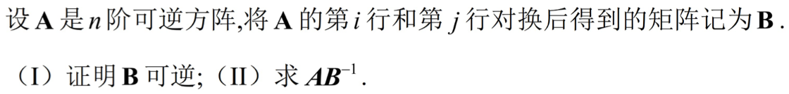\
链接:
[note/20DBF888-3C80-4F70-9487-3D105AE51D03](marginnote4app://note/20DBF888-3C80-4F70-9487-3D105AE51D03)\
设A是n阶可逆方阵,将A的第行和第/行对换后得到的矩阵记为B.
(1)证明B可逆:(I)求AB. \

###### 1997数三  {#1997数三}

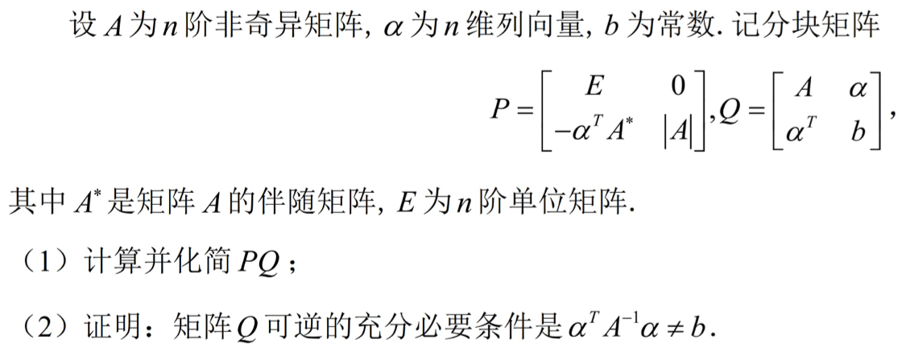\
链接:
[note/247E70E9-8E77-4068-AB2A-1FBC43A00286](marginnote4app://note/247E70E9-8E77-4068-AB2A-1FBC43A00286)\
设4为n阶非奇异矩阵,α为n维列向量,b为常数.记分块矩阵「EP= 01「Aa os ele
其中是矩阵4的伴随矩阵,E为n阶单位矩阵. (1)计算并化简PQ:
(2)证明:矩阵Q可逆的充分必要条件是a\'A\'a+b. \

###### 2002数二  {#2002数二}

\
链接:
[note/E97B4CCA-FCBC-4904-8E9C-C2DC4DB187DD](marginnote4app://note/E97B4CCA-FCBC-4904-8E9C-C2DC4DB187DD)\
已知A,B为三阶矩阵,且满足2AB=B-4E,其中E是三阶单位矩阵「1-20
(1)证明矩阵A-2E可逆:(2)若B=120,求矩阵A 002\

###### 2008数一二三  {#2008数一二三}

\
链接:
[note/80C1F8E6-FB71-493E-B3E1-A123DE6329BE](marginnote4app://note/80C1F8E6-FB71-493E-B3E1-A123DE6329BE)\
(5)设4为阶非0矩阵E为阶单位矩阵若=0,则()
(A)E-4不可逆,E+4不可逆(C)E-A可逆,E+4可逆(B)E-4不可逆,E+4可逆(D)E-4可逆,E+4不可逆\

###### 姜晓千强化例题 

\
链接:
[note/ED40766A-0572-4AB6-9B63-2E1EB12F88F8](marginnote4app://note/ED40766A-0572-4AB6-9B63-2E1EB12F88F8)\
【例2.4】设n阶矩阵4满是4=24,则下列结论不正确的是【】(A)A可逆(B)4-E可逆(C)A+E可道(D)4-3E可通\

###### 2017数一三  {#2017数一三}

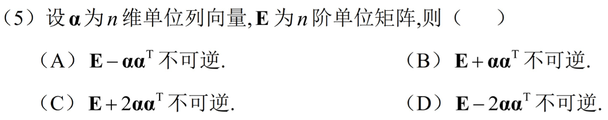\
链接:
[note/03E15811-B9D8-4E0C-8520-E0E4D68085FA](marginnote4app://note/03E15811-B9D8-4E0C-8520-E0E4D68085FA)\
(5)设u为n维单位列向量,E为n阶单位矩阵则()
(A)E-uu\'不可逆(C)E+2au\'不可逆(B)E+au\'不可逆(D)E-2au\'不可逆\

###### 900题数二第五章A类22  {#900题数二第五章a类22}

\
链接:
[note/D0CC4220-8F7D-4477-ADA0-A78E1458B722](marginnote4app://note/D0CC4220-8F7D-4477-ADA0-A78E1458B722)\
22设A为2阶矩阵,a和B为2维列向量,且Aa,AB线性无关.矩阵P=(u,B).
(I)证明:P为可逆矩阵. (Ⅱ)若Aa=B,AB=2a,求P\'AP,并判断A是否相似于对角矩阵\

###### 25版880矩阵基础解答2  {#25版880矩阵基础解答2}

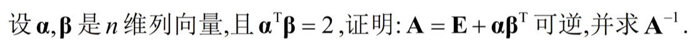\
链接:
[note/885BE0B2-0353-4370-9EE6-E4ED2EFE79C7](marginnote4app://note/885BE0B2-0353-4370-9EE6-E4ED2EFE79C7)\
设u,B是n维列向量,且uB=2,证明:A=E+uB\'可逆,并求A. \

###### 25版880矩阵基础解答10  {#25版880矩阵基础解答10}

\
链接:
[note/4FB75622-C056-4065-8308-C944E963D448](marginnote4app://note/4FB75622-C056-4065-8308-C944E963D448)\
设A为2n+1阶正交矩阵,且\]A=1,证明:A一E不可逆\

###### 25版880矩阵基础解答11  {#25版880矩阵基础解答11}

\
链接:
[note/F7E6DC6E-EA8D-4BFE-BB08-F7A6B00EE1CD](marginnote4app://note/F7E6DC6E-EA8D-4BFE-BB08-F7A6B00EE1CD)\
设n阶方阵A,B,满足A=EBF=E.且lAl+lB=O.证明:A+B不可逆\

###### 900题数二第二章C类1  {#900题数二第二章c类1}

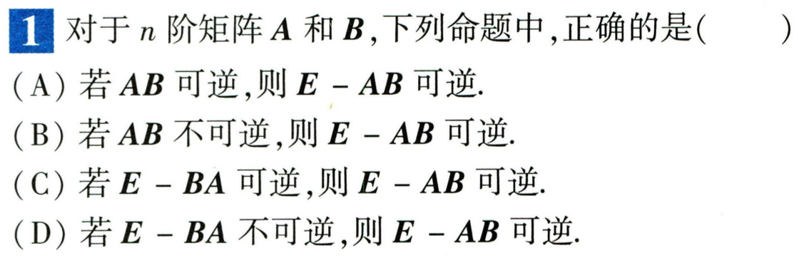\
链接:
[note/86BF844E-473F-4C8D-BB27-3157CA6E7ECC](marginnote4app://note/86BF844E-473F-4C8D-BB27-3157CA6E7ECC)\
工对于n阶矩阵A和B,下列命题中,正确的是(
(A)若AB可逆,则E-AB可逆(B)若AB不可逆,则E-AB可逆(C)若E-BA可逆,则E-AB可逆(D)若E-BA不可逆,则E-AB可逆\

###### 姜晓千真题同源150  {#姜晓千真题同源150-3}

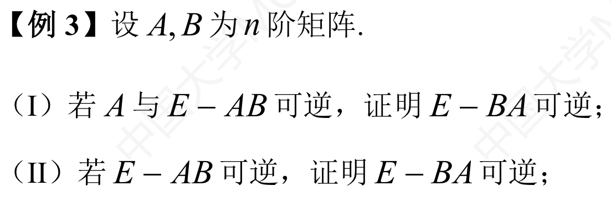\
链接:
[note/CE7019DC-2E85-4168-8BA6-E63B0B7BD112](marginnote4app://note/CE7019DC-2E85-4168-8BA6-E63B0B7BD112)\
【例 3】设 , A B 为 n 阶矩阵. (I)若 A 与ABE −可逆,证明BAE
−可逆;(II)若ABE −可逆,证明BAE −可逆; 中国大学MO 中国大学M\

###### 900题数二第二章A类17（选做）  {#900题数二第二章a类17选做}

\
链接:
[note/B0593837-3AEA-490D-A309-92B322A54DAC](marginnote4app://note/B0593837-3AEA-490D-A309-92B322A54DAC)\
(0ab 17设A= /100 a0c为可逆矩阵,E为3阶单位矩阵,B= bc 0 040 000
(1)计算E-AB,并指出A中元素满足什么条件时,E-AB为可逆矩阵(Ⅱ)当E-AB可逆时,证明(E-AB)\'A=\[(A\'-B)\]\"\

#### 伴随矩阵 

链接:
[note/2AA592B2-AB0F-47E7-B10C-CA60BB61617A](marginnote4app://note/2AA592B2-AB0F-47E7-B10C-CA60BB61617A)\
`<html xmlns="http://www.w3.org/1999/xhtml">`{=html}`<head>`{=html}`<meta http-equiv="Content-Type" content="text/html; charset=UTF-8" />`{=html}`</head>`{=html}`<body />`{=html}`</html>`{=html}

##### 伴随性质 

链接:
[note/F1080E62-4474-4E42-A8A4-BB1DFB88F8FB](marginnote4app://note/F1080E62-4474-4E42-A8A4-BB1DFB88F8FB)\
`<html xmlns="http://www.w3.org/1999/xhtml">`{=html}`<head>`{=html}`<meta http-equiv="Content-Type" content="text/html; charset=UTF-8" />`{=html}`</head>`{=html}`<body />`{=html}`</html>`{=html}

###### 1996数三  {#1996数三}

\
链接:
[note/2650F912-6827-4259-995A-C14A39B35FD0](marginnote4app://note/2650F912-6827-4259-995A-C14A39B35FD0)\
设n阶矩阵4非奇异(n22),是矩阵4的伴随矩阵,则() (A) (A)\'=A\"A
(B)(4A)\'=4\"A (C) (A)=AA(D)(A4)=A2A\

###### 1998数二  {#1998数二}

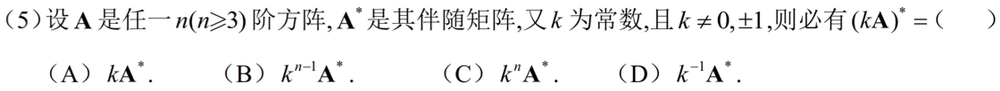\
链接:
[note/F35109CE-395F-4193-AB0B-CEE2B552D6C1](marginnote4app://note/F35109CE-395F-4193-AB0B-CEE2B552D6C1)\
(5)设A是任一nm23)阶方阵,A\'是其伴随矩阵,又k为常数,且rz0±1,则必有(&A=()
(A)kA.(B) k\"A\'.(C) \"A\'. (D) kA\'. \

###### 900题数二第五章C类2（重点）  {#900题数二第五章c类2重点}

\
链接:
[note/BF0950A0-66AA-4D40-876B-87EC7544CA61](marginnote4app://note/BF0950A0-66AA-4D40-876B-87EC7544CA61)\
2设A为3阶实对称矩阵,A的各行元素之和均为0,若A的全部非零特征值为1,6,则下列命题中,正确的个数为()
1A"的全部元素均不为0. 336是4°的唯一非零特征值(A)1. (B)2. (C)3. 2(4)≠0.
4Ax=0与Ax=0有非零公共解(D)4. \

###### 25版880矩阵基础选择2  {#25版880矩阵基础选择2}

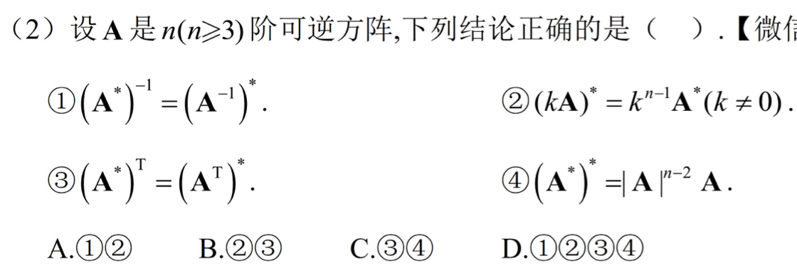\
链接:
[note/68ED2D5E-B47C-4906-9028-7C451AC84736](marginnote4app://note/68ED2D5E-B47C-4906-9028-7C451AC84736)\
(2)设A是nmz3)阶可逆方阵,下列结论正确的是().【微信@(A)-(A) @(A)\'=(A)
A.02B.23 C.34D.00842(kA)\'=k\"A\'(k+0) @(A)HAA. \

###### 25版880矩阵基础填空8  {#25版880矩阵基础填空8}

\
链接:
[note/545C9654-2790-4E4E-BD19-0EAA3748F56C](marginnote4app://note/545C9654-2790-4E4E-BD19-0EAA3748F56C)\
若A"=En为正整数,则(A)=\

###### 25李永乐六套数一二三第三套  {#25李永乐六套数一二三第三套-2}

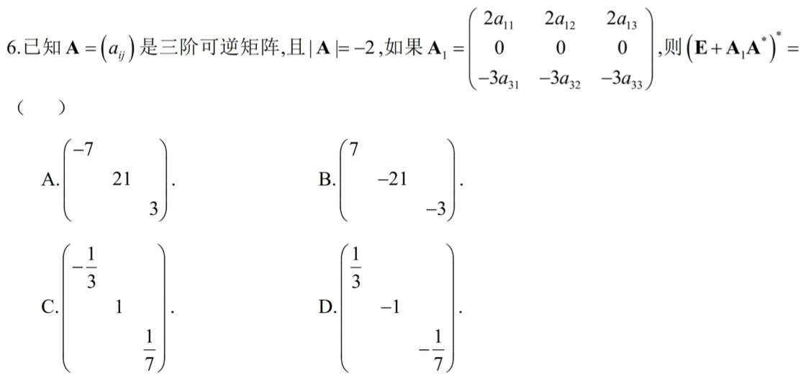\
链接:
[note/90115BB3-B32C-4FC9-BC8A-B6D4929C7D31](marginnote4app://note/90115BB3-B32C-4FC9-BC8A-B6D4929C7D31)\
2012022013 6.已知A=(a,)是三阶可逆矩阵,且\[A=-2,如果A,=000,则(E+A,A\')
-3031-3032-3033/ 3B -21 (13 0 C. \

###### 900题数二第二章B类6（选做）  {#900题数二第二章b类6选做}

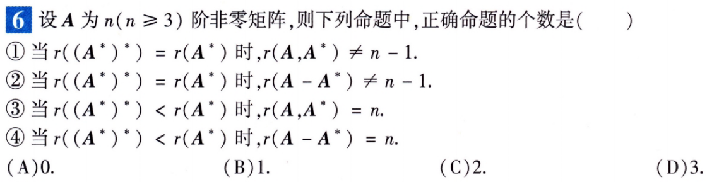\
链接:
[note/3E5CA7D8-0054-48DC-8444-D7744157AC87](marginnote4app://note/3E5CA7D8-0054-48DC-8444-D7744157AC87)\
6设A为n(n≥3)阶非零矩阵,则下列命题中,正确命题的个数是( )
1当r((A*)*)=r(A*)时,r(A,A*)≠n-1. 2当r((A*)*)=r(A\')时,r(A-A\')≠n-1.
3当r((A\')*)\<r(A\')时,r(A,A\')= n. 4当r((A\')*)\<r(A\')时,r(A-A\')=n.
(A)0. (B)1. (C)2 (D)3. \

##### 伴随等于转置或本身 

链接:
[note/FA6EFF8A-C56A-44DC-9597-23D514CB3FFB](marginnote4app://note/FA6EFF8A-C56A-44DC-9597-23D514CB3FFB)\
`<html xmlns="http://www.w3.org/1999/xhtml">`{=html}`<head>`{=html}`<meta http-equiv="Content-Type" content="text/html; charset=UTF-8" />`{=html}`</head>`{=html}`<body />`{=html}`</html>`{=html}

###### 1994数一  {#1994数一}

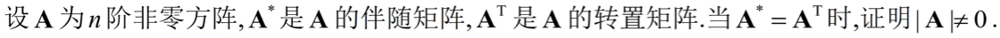\
链接:
[note/F9D3704D-0E02-41CD-98D9-02B6EA3E64DD](marginnote4app://note/F9D3704D-0E02-41CD-98D9-02B6EA3E64DD)\
设A为n阶非零方阵,A是A的伴随矩阵,A\'是A的转置矩阵.当A\'=A\'时,证明\]Az0\

###### 2005数三  {#2005数三}

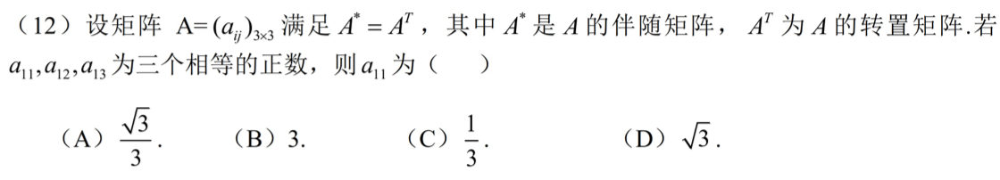\
链接:
[note/749367E4-3482-4C52-BD34-420CD71B2900](marginnote4app://note/749367E4-3482-4C52-BD34-420CD71B2900)\
(12)设矩阵A=(au)ha满足f=,其中是4的伴随矩阵,为4的转置矩阵.若a,a2,a3为三个相等的正数,则为()
(A) 5(B)3. o (D)√3. \

###### 25版880行列式基础选择4😅  {#25版880行列式基础选择4😅}

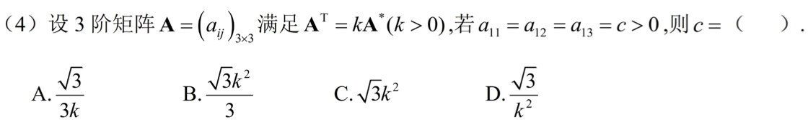\
链接:
[note/8D86A26C-B6F5-4E7B-9410-D57E18EF2EFF](marginnote4app://note/8D86A26C-B6F5-4E7B-9410-D57E18EF2EFF)\
(4)设3阶矩阵A=(a),满足A\'=kA\'(k\>0),若4i=4p=4p=c\>0,则c=(). 4.G B34
C.3k 3k 3 3D. e\

###### 2013数一二三  {#2013数一二三}

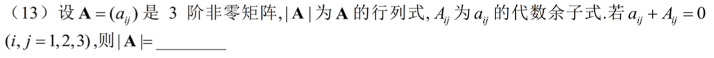\
链接:
[note/CB1C1C40-E90D-483C-BC03-DB6CAB1BDDF3](marginnote4app://note/CB1C1C40-E90D-483C-BC03-DB6CAB1BDDF3)\
(13)设A=(a)是3阶非零矩阵,\[A\]为A的行列式,4为a,的代数余子式.若,+4=0
(,/=12,3),则\]A=\

###### 25版880行列式拓展1  {#25版880行列式拓展1}

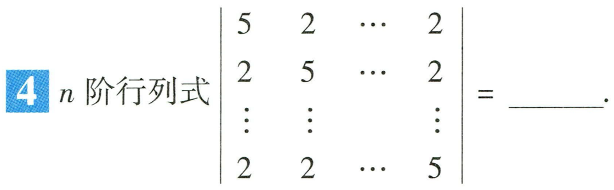\
链接:
[note/E9FA25B4-2616-43DD-9F7E-76CC4E41FF55](marginnote4app://note/E9FA25B4-2616-43DD-9F7E-76CC4E41FF55)\
设矩阵A为3阶非零实矩阵,A\'=A,且lE+AHE-A=0,计算行列式A\'-A-3E\

###### 姜晓千真题同源150（重点） 

\
链接:
[note/BB5413A9-7860-4FE6-BB6D-DE1BDCCD74A4](marginnote4app://note/BB5413A9-7860-4FE6-BB6D-DE1BDCCD74A4)\
【例 8】设()ij Aa= 为 3 阶非零矩阵,ij A 为ij a 的代数余子式,2( ,1,2,3)
ij ij Aa i j = = ,则 A = . 中国大学中国大学中国大学中\

###### 900题数二第二章B类7  {#900题数二第二章b类7}

\
链接:
[note/FFA76CEF-A9F7-47BE-97D2-C95D2B62F578](marginnote4app://note/FFA76CEF-A9F7-47BE-97D2-C95D2B62F578)\
7设A为n(nz2)阶非零矩阵,且满足ag=Agi,j=1,2,...,n,其中A,为a,的代数余子式,则下列说法中,正确的是()
(A)A为可逆矩阵. (C)lA\<0. (B)A为对称矩阵. (D)A的所有元素的平方和为n\

###### 900题数二第二章A类5  {#900题数二第二章a类5}

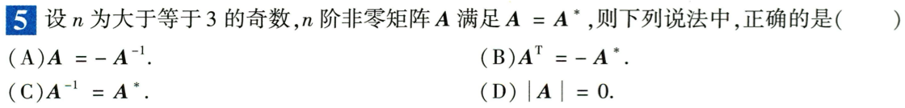\
链接:
[note/BEC5D3E9-008C-4A5C-BEA7-458C7AD699A2](marginnote4app://note/BEC5D3E9-008C-4A5C-BEA7-458C7AD699A2)\
5设z为大于等于3的奇数,n阶非零矩阵A满足A=A",则下列说法中,正确的是(
(A)A=-A\'. (C)A\'=A\'. (B)AT\--A\". (D)A=0. \

#### 秩 

链接:
[note/6C1FB017-13C6-4BE3-B0B6-99A93AD0C672](marginnote4app://note/6C1FB017-13C6-4BE3-B0B6-99A93AD0C672)\
`<html xmlns="http://www.w3.org/1999/xhtml">`{=html}`<head>`{=html}`<meta http-equiv="Content-Type" content="text/html; charset=UTF-8" />`{=html}`</head>`{=html}`<body />`{=html}`</html>`{=html}

##### 求秩及证明秩 

链接:
[note/E365584C-BF3A-40ED-864B-C0696FA2ADF3](marginnote4app://note/E365584C-BF3A-40ED-864B-C0696FA2ADF3)\
`<html xmlns="http://www.w3.org/1999/xhtml">`{=html}`<head>`{=html}`<meta http-equiv="Content-Type" content="text/html; charset=UTF-8" />`{=html}`</head>`{=html}`<body />`{=html}`</html>`{=html}

###### 1987数三  {#1987数三}

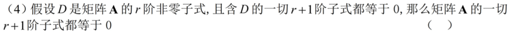\
链接:
[note/60948CE1-D47E-4859-B391-F73A630DCABF](marginnote4app://note/60948CE1-D47E-4859-B391-F73A630DCABF)\
(4)假设D是矩阵A的r阶非零子式,且含D的一切r+1阶子式都等于0,那么矩阵A的一切r+1阶子式都等于0
()\

###### 1990数一  {#1990数一}

\
链接:
[note/0B632588-E63A-4F0E-BE8C-6774EABA2873](marginnote4app://note/0B632588-E63A-4F0E-BE8C-6774EABA2873)\
(5)已知向量组u=(1,2,3,4),u;=(2,34,5).6=(3.4,56).u,=(4567,则该向量组的秩是\

###### 1992数一  {#1992数一}

\
链接:
[note/6279A15D-8BB9-439C-9E54-BC9FB89B0EDF](marginnote4app://note/6279A15D-8BB9-439C-9E54-BC9FB89B0EDF)\
ab abr240 a:b)6a:b 设A= 其中a≠0,b,≠0i=1,2,...,),则矩阵A的秩r(A)= a,bao
ab\

###### 1993数三  {#1993数三}

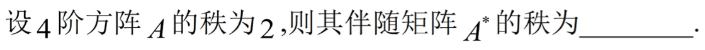\
链接:
[note/C98821D0-093E-4121-8DD9-823955F41E95](marginnote4app://note/C98821D0-093E-4121-8DD9-823955F41E95)\
设4阶方阵4的秩为2,则其伴随矩阵r的秩为\

###### 1994数三  {#1994数三-2}

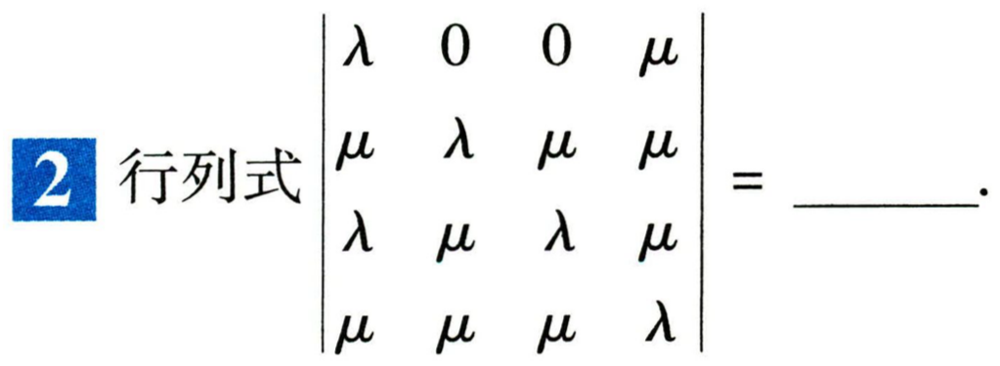\
链接:
[note/F2615965-3E59-4B06-871E-99CD8531BCC5](marginnote4app://note/F2615965-3E59-4B06-871E-99CD8531BCC5)\
(3)设4是mxn矩阵,C是n阶可逆矩阵,矩阵4的秩为r,矩阵B=4C的秩为;,则() (A)
r\>n (B) r\<i (C)r=n (D)r与;的关系由C而定\

###### 1995数三  {#1995数三-2}

\
链接:
[note/402490D6-51ED-4CC3-84C1-4A6A5A3AC920](marginnote4app://note/402490D6-51ED-4CC3-84C1-4A6A5A3AC920)\
已知向量组(l)a,.g;(H)g,.,4;
(H)a,.g,6,如果各向量组的秩分别为r()=r()=3,r(IH)=4.证明:向量组a,,6,s-a的秩为4.\

###### 1996数一  {#1996数一-3}

\
链接:
[note/7FAC520E-ADC7-4A3B-9D61-8A5765AD8FB5](marginnote4app://note/7FAC520E-ADC7-4A3B-9D61-8A5765AD8FB5)\
102 设A是4x3矩阵,且A的秩r(A)=2,而B=020,则r(AB)= -103\

###### 2007数一二三  {#2007数一二三}

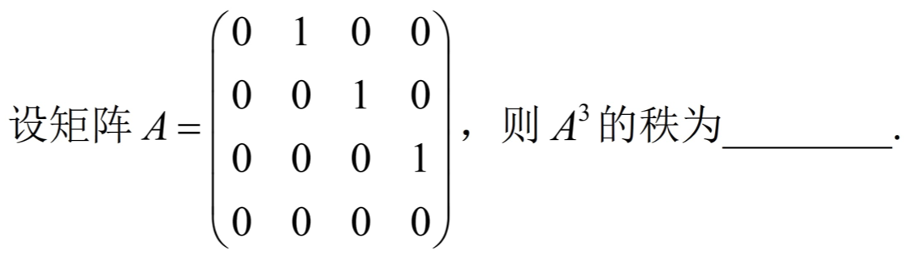\
链接:
[note/FF2CE06C-7A24-419C-8573-D87AF0705D3A](marginnote4app://note/FF2CE06C-7A24-419C-8573-D87AF0705D3A)\
/0100 0010 设矩阵4= ,则的秩为0001 0000\

###### 2008数一  {#2008数一}

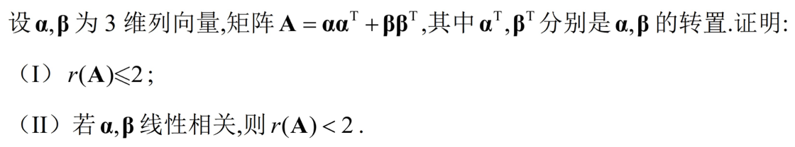\
链接:
[note/542819BD-7E54-4F42-A266-0D61AE3B7189](marginnote4app://note/542819BD-7E54-4F42-A266-0D61AE3B7189)\
设u,β为3维列向量,矩阵A=uu\'+BB,其中u\',B\'分别是u,β的转置.证明: (1D
r(A)S2; (H)若u,β线性相关,则r(A)\<2. \

###### 2010数一  {#2010数一}

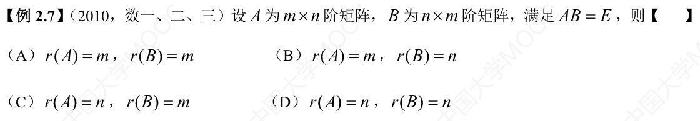\
链接:
[note/354C10F1-F3E7-4B84-9B29-248CA5474DC4](marginnote4app://note/354C10F1-F3E7-4B84-9B29-248CA5474DC4)\
2.72010 Am n Bn m ABE A( )r Am( )r Bm B( )r Am( )r Bn C( )r An( )r Bm D
( )r An( )r Bn 中国大学MOOC 中国大学MOOC 中国大学MOOC 中国大学M\

###### 2012数一  {#2012数一}

\
链接:
[note/3B0622AC-5B5E-4705-8D0C-6DC845C8BE5C](marginnote4app://note/3B0622AC-5B5E-4705-8D0C-6DC845C8BE5C)\
设a为3维单位列向量E为3阶单位矩阵则矩阵E-uu\'的秩为\

###### 2017数一三  {#2017数一三-2}

\
链接:
[note/B6A64DD6-B20E-4C89-9883-CD886DF1F93B](marginnote4app://note/B6A64DD6-B20E-4C89-9883-CD886DF1F93B)\
/1 0 1 (13)设矩阵A=1 1
2,u;u,u;为线性无关的3维列向量组,则向量组Au,Aa,,Aa,的秩011 为\

###### 2019数学二三  {#2019数学二三}

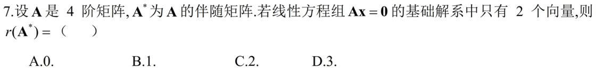\
链接:
[note/F6E01A6B-06A1-42C0-8B97-DF6B2524DA05](marginnote4app://note/F6E01A6B-06A1-42C0-8B97-DF6B2524DA05)\
7设A是4阶矩阵,A为A的伴随矩阵若线性方程组Ax=0的基础解系中只有2个向量则(A)=()
A.0. B.1. C.2 D.3\

###### 姜晓千基础例题  {#姜晓千基础例题-12}

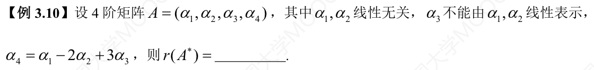\
链接:
[note/BB348DDA-1DBB-4620-9133-700B7C529103](marginnote4app://note/BB348DDA-1DBB-4620-9133-700B7C529103)\
3.10 4 1234 (,,,) A 12, 3 12, 4 1 2 3 23 ()r A . 国大学MOOC 国大学MOOC
国大学MOOC\

###### 姜晓千基础例题  {#姜晓千基础例题-13}

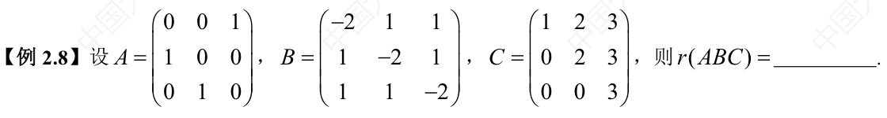\
链接:
[note/439860F5-5DFE-4B66-811D-E5240A8EC186](marginnote4app://note/439860F5-5DFE-4B66-811D-E5240A8EC186)\
2.8 001 100 010 A 211 121 112 B 123 023 003 C () r ABC .
中国大中国大中国大中国大\

###### 25版880矩阵基础填空6  {#25版880矩阵基础填空6}

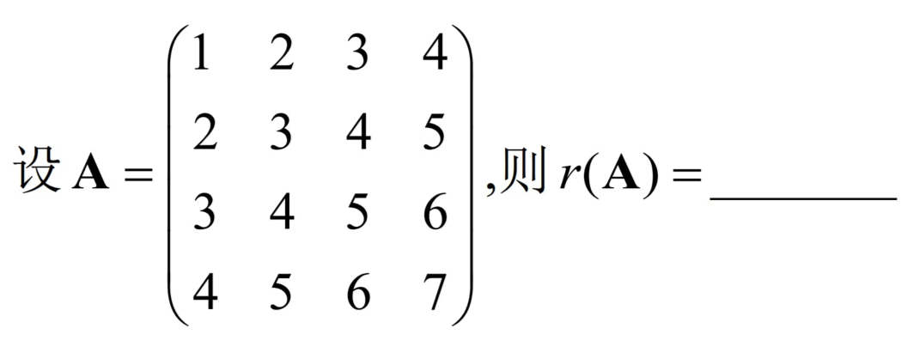\
链接:
[note/CAA25A75-632C-4829-AE79-C7176C3F3216](marginnote4app://note/CAA25A75-632C-4829-AE79-C7176C3F3216)\
(1234 2345 设A= ,则r(A) 4567\

###### 25版880向量综合选择5  {#25版880向量综合选择5}

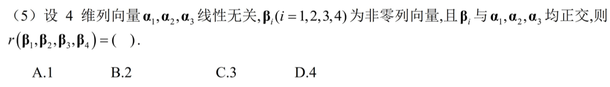\
链接:
[note/4C46BA20-0DB4-4836-BC5B-6BA513324BBD](marginnote4app://note/4C46BA20-0DB4-4836-BC5B-6BA513324BBD)\
(5)设4维列向量u,u,u,线性无关,B(0=L.2.3.4)为非零列向量,且B,与a,u,u,均正交,则r(B,B,Bs,B4)=().
A.l B.2 C.3 D.4\

###### 900题数二第二章A类10  {#900题数二第二章a类10}

\
链接:
[note/5DDA6DFF-CAC1-4F4A-98B8-847EA9CC9CF9](marginnote4app://note/5DDA6DFF-CAC1-4F4A-98B8-847EA9CC9CF9)\
10已知矩阵A是mxn矩阵,B是nxm矩阵,则下列说法中,正确的是(
(A)若AB≠0,则A行满秩,B列满秩. (B)AB=BA. (C)AB≠BA. (D)tr(AB)≠tr(BA). )\

###### 姜晓千强化例题 

\
链接:
[note/56A4DA80-0EBF-4C33-9B96-0CFC71F6CBC3](marginnote4app://note/56A4DA80-0EBF-4C33-9B96-0CFC71F6CBC3)\
【例5.6】设4= /1000 0300 0011 0022 矩阵B与4相似,则r(B-E)+r(B-3E)=\

###### 900题数二第五章A类6  {#900题数二第五章a类6}

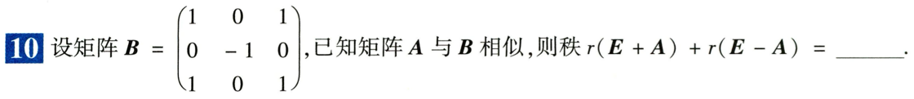\
链接:
[note/8B2D72D7-6962-4874-BF80-7E9320A7E2C9](marginnote4app://note/8B2D72D7-6962-4874-BF80-7E9320A7E2C9)\
101 10设矩阵B=0-10,已知矩阵A与B相似,则秩r(E+A)+r(E-A)= 101/\

###### 25版880相似基础填空4  {#25版880相似基础填空4}

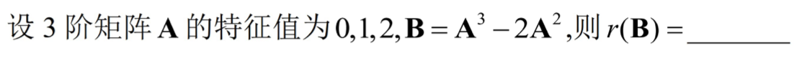\
链接:
[note/EA62A049-8424-4F0F-9DA3-05D2C91CE596](marginnote4app://note/EA62A049-8424-4F0F-9DA3-05D2C91CE596)\
设3阶矩阵A的特征值为0,1.2,B=A-2A,则r(B)=\

###### 25版880相似综合选择2  {#25版880相似综合选择2}

\
链接:
[note/8184AC19-BB7A-487A-9D5E-88544BFF19F0](marginnote4app://note/8184AC19-BB7A-487A-9D5E-88544BFF19F0)\
/1100 1100 (2)设矩阵B相似于A= ,则n=r(B),s=r(B-E),g=r(B-2E)满足(). 0022
0022 A.n\<乃\<5 B.6\<5\<f C.n\<i\<乃D.n\<5\<5\

###### 25版880相似基础选择2  {#25版880相似基础选择2}

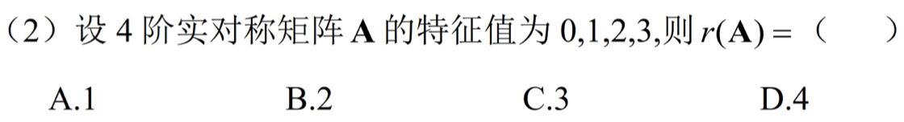\
链接:
[note/2113F89F-071C-4F69-8EDF-82E9AEF8AEBC](marginnote4app://note/2113F89F-071C-4F69-8EDF-82E9AEF8AEBC)\
(2)设4阶实对称矩阵A的特征值为0.1,23,则r(A)=() A.1 B.2 C.3 D.4\

###### 900题数二第二章A类19  {#900题数二第二章a类19}

\
链接:
[note/DA65F816-4C36-4C39-B891-D99016D73664](marginnote4app://note/DA65F816-4C36-4C39-B891-D99016D73664)\
19已知n阶矩阵A满足等式AF-3A+2E=O,其中E为n阶单位矩阵.计算r(A)+r(A
E)+r(A-2E) +r(A-3E). \

###### 900题数二第二章A类8  {#900题数二第二章a类8}

\
链接:
[note/0EFA91F4-73D2-49F5-BDF4-6D69678F84A6](marginnote4app://note/0EFA91F4-73D2-49F5-BDF4-6D69678F84A6)\
8设A,B均为n(n≥2)阶矩阵,满足A-B-AB=E,则下列4值中,使r(A+E)+r(B
-E)最小的是() (A)-2. (B)-1. (C)1. (D)2\

###### 24余丙森五数一二第五套（重点）  {#24余丙森五数一二第五套重点}

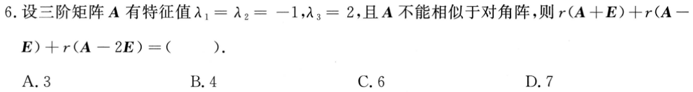\
链接:
[note/6B092820-7841-412A-B894-09EBCAD22E22](marginnote4app://note/6B092820-7841-412A-B894-09EBCAD22E22)\
6.设三阶矩阵A有特征值Ar=Az=-l,Ay=2,且A不能相似于对角阵,则r(A十E)+r(A-E)+r(A-2E)=().
A.3 B. 4 C. 6 D.7\

##### 已知秩 确定参数 

链接:
[note/5B02AD71-22BD-444E-AA13-FF4EE67A0CE4](marginnote4app://note/5B02AD71-22BD-444E-AA13-FF4EE67A0CE4)\
`<html xmlns="http://www.w3.org/1999/xhtml">`{=html}`<head>`{=html}`<meta http-equiv="Content-Type" content="text/html; charset=UTF-8" />`{=html}`</head>`{=html}`<body />`{=html}`</html>`{=html}

###### 1997数二  {#1997数二}

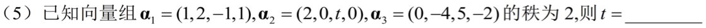\
链接:
[note/46FBFBA1-A3A3-4D82-8F52-D1670B78D781](marginnote4app://note/46FBFBA1-A3A3-4D82-8F52-D1670B78D781)\
(5)已知向量组u=(1,2,-11),a;=(2,0,,0),g=(0,-4,5,-2)的秩为2,则1=\

###### 1998数三  {#1998数三}

\
链接:
[note/DE061ECF-6613-4D8F-AB69-17E1ED761A68](marginnote4app://note/DE061ECF-6613-4D8F-AB69-17E1ED761A68)\
「1 aa a1a0 (4)设n(n23)阶矩阵4=aa1...aa0 1 (A)1(B)T-R (C)-1
a,若矩阵4的秩为n-1,则a必为() (D)\_I\

###### 2001数三  {#2001数三}

\
链接:
[note/13317856-B9CF-468A-BFFC-7A6E30442EA6](marginnote4app://note/13317856-B9CF-468A-BFFC-7A6E30442EA6)\
2.62001 111 1 11 11 1 111 k k A k k ( )3 r A k**\_\_****\_**.
中国大学MOOC 中中国大学MOOC 中\

###### 2003数三; 25版880矩阵综合选择2  {#2003数三-25版880矩阵综合选择2}

\
链接:
[note/8BECBB62-1100-4088-A716-4492BDB40AC6](marginnote4app://note/8BECBB62-1100-4088-A716-4492BDB40AC6)\
2.102003 abb Abab bba () 1 r A Aab 20 ab Bab 20 ab Cab 20 ab Dab 20 ab
OC 中国大学M OC 中国大学M 中国大学\

###### 姜晓千基础例题  {#姜晓千基础例题-14}

\
链接:
[note/0B09149A-CE38-4430-AC16-31F83002E368](marginnote4app://note/0B09149A-CE38-4430-AC16-31F83002E368)\
2.9 1111 01 1 2 34 3157b A a ( )2 r A a b . OC 中国大学MOOC OC
中国大学MOOC\

###### 25李永乐六套数一二三第六套  {#25李永乐六套数一二三第六套}

\
链接:
[note/9223E494-4EE3-4A83-9F18-EB946603AED5](marginnote4app://note/9223E494-4EE3-4A83-9F18-EB946603AED5)\
(a a 2 8.设A=uB7,其中u=(13,2)\",B=(a.-L.a)\',B=a2
a,A和BF分别是A和B的伴随矩阵, 如果r(A-B)=1,则a=() A.1. B.-1. 2aa C.2.
D.-2. \

##### 利用秩推理 

链接:
[note/565CE23A-DC8A-489D-A5A6-9393EB84E2B6](marginnote4app://note/565CE23A-DC8A-489D-A5A6-9393EB84E2B6)\
`<html xmlns="http://www.w3.org/1999/xhtml">`{=html}`<head>`{=html}`<meta http-equiv="Content-Type" content="text/html; charset=UTF-8" />`{=html}`</head>`{=html}`<body />`{=html}`</html>`{=html}

###### 24余丙森五数一二第三套  {#24余丙森五数一二第三套}

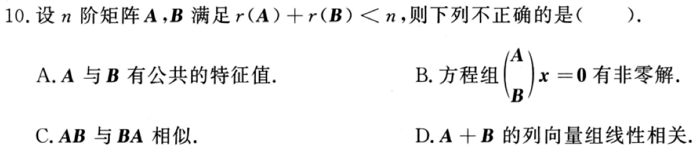\
链接:
[note/BC7349D1-32B6-49C9-A86C-2DF6ABE5A893](marginnote4app://note/BC7349D1-32B6-49C9-A86C-2DF6ABE5A893)\
10.设n阶矩阵A,B满足r(A)十r(B)\<n,则下列不正确的是().
A.A与B有公共的特征值. C.AB与BA相似B.方程组x=0有非零解B
D.A+B的列向量组线性相关\

###### 24余丙森五数一二第四套  {#24余丙森五数一二第四套}

\
链接:
[note/11E1F112-0BD6-4E1D-B610-15940903001C](marginnote4app://note/11E1F112-0BD6-4E1D-B610-15940903001C)\
10.设A为m×n型实矩阵,r(A)=n,则(). A.AA\'相似于m阶单位矩阵E,。
B.AA'合同于m阶单位矩阵E。 C.A\'A相似于n阶单位矩阵E
D.A\'A合同于n阶单位矩阵E,\

###### 23🐙八数二三第一套  {#23🐙八数二三第一套}

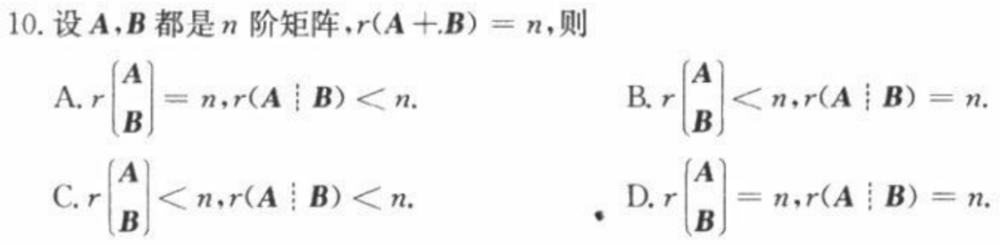\
链接:
[note/DE2D2C62-4F1D-4A14-8351-C57298E7DDE3](marginnote4app://note/DE2D2C62-4F1D-4A14-8351-C57298E7DDE3)\
10.设A,B都是n阶矩阵,r(A十B)=n,则NrB(A=n,r(AB)\<n BrB C.B\<nr(AB)\<n.
D7B) (A\<n,r(AiB)=n (A=n,r(AB)=n. \

###### 25李永乐六套数一二三第一套  {#25李永乐六套数一二三第一套}

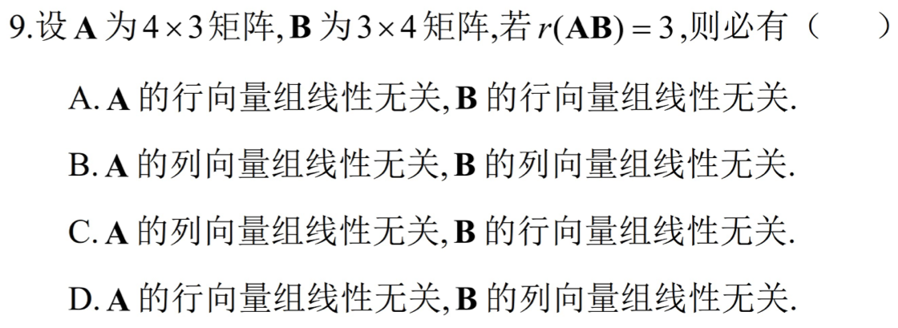\
链接:
[note/ABBFA2C9-B4B2-44E9-9265-829874D25E20](marginnote4app://note/ABBFA2C9-B4B2-44E9-9265-829874D25E20)\
人入的行向量组线性无关R的行向量们娃烛干羊\

#### 高次幂 

链接:
[note/0EA3BDAD-03AB-4851-8B06-9E40F09E7E85](marginnote4app://note/0EA3BDAD-03AB-4851-8B06-9E40F09E7E85)\
`<html xmlns="http://www.w3.org/1999/xhtml">`{=html}`<head>`{=html}`<meta http-equiv="Content-Type" content="text/html; charset=UTF-8" />`{=html}`</head>`{=html}`<body />`{=html}`</html>`{=html}

##### 1988数一  {#1988数一-2}

\
链接:
[note/9D5A7C88-A763-4E77-9B1A-6317FEECB817](marginnote4app://note/9D5A7C88-A763-4E77-9B1A-6317FEECB817)\
/100 已知AP=PB,其中B= /100 000,P=2-10,求A及A. 00-1211\

##### 1992数一; 25版880向量综合解答6  {#1992数一-25版880向量综合解答6}

\
链接:
[note/101FB48B-8155-4AA1-916F-60EA258DE48E](marginnote4app://note/101FB48B-8155-4AA1-916F-60EA258DE48E)\
设3阶矩阵A的特征值为4=1&=2,4=3,对应的特征向量依次为又向量β3
(1)将β用点,,乌线性表出; (2)求A\"B(n为自然数). \

##### 1994数一  {#1994数一-2}

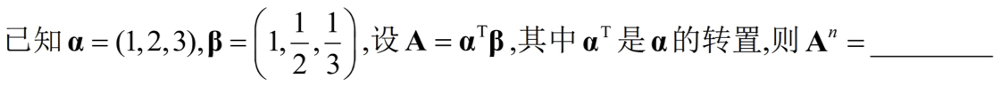\
链接:
[note/D86181B6-C946-4AF2-B662-5B0305C8CD62](marginnote4app://note/D86181B6-C946-4AF2-B662-5B0305C8CD62)\
已知weL23p-L没A=wB,其中w是e的转流则N。 \

##### 25版880矩阵基础填空1😅  {#25版880矩阵基础填空1😅}

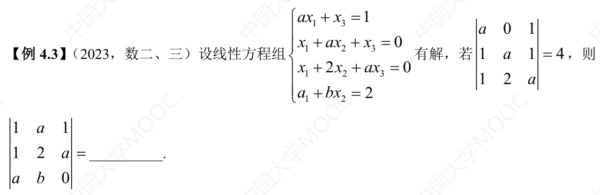\
链接:
[note/A0C951B4-4B75-493B-8350-FB4BF978522C](marginnote4app://note/A0C951B4-4B75-493B-8350-FB4BF978522C)\
8w=0ayA=p测N\

##### 姜晓千基础例题  {#姜晓千基础例题-15}

\
链接:
[note/9E537F4A-7439-411D-9184-4B6C8EABE574](marginnote4app://note/9E537F4A-7439-411D-9184-4B6C8EABE574)\
(1,2,1)T T) 0 ,21, 1 ( T A 4A . 中国大学中国大学中国大学\

##### 1999数三  {#1999数三}

\
链接:
[note/CEFEBE08-1732-449B-B4B9-6591A2569D11](marginnote4app://note/CEFEBE08-1732-449B-B4B9-6591A2569D11)\
「1 0 1 设4=020,而n22为正整数,则f-2= 101\

##### 2000数一  {#2000数一}

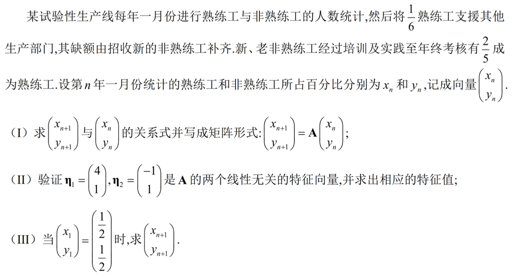\
链接:
[note/751B1622-B0B5-44C5-857B-AD32FC0A2865](marginnote4app://note/751B1622-B0B5-44C5-857B-AD32FC0A2865)\
某试验性生产线每年一月份进行熟练工与非熟练工的人数统计,然后将一熟练工支援其他生产部门,其缺额由招收新的非熟练工补齐.新、老非熟练工经过培训及实践至年终考核有二成为熟练工.设第n年一月份统计的熟练工和非熟练工所占百分比分别为x和y,记成向量师歌)
的关系式并写成矩阵形式: y. y1)
是A的两个线性无关的特征向量,并求出相应的特征值(ID 时,求\

##### 2024数一  {#2024数一}

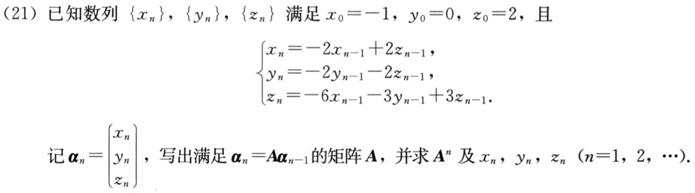\
链接:
[note/6A0BB7F5-541E-4CF1-AF94-1FD6745DEA6B](marginnote4app://note/6A0BB7F5-541E-4CF1-AF94-1FD6745DEA6B)\
(x.=-2x. \

##### 25版880相似拓展3  {#25版880相似拓展3}

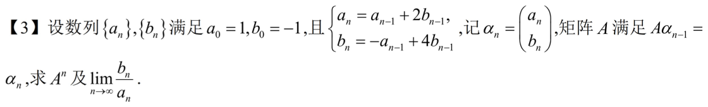\
链接:
[note/698C6EEA-6E60-4DB0-9435-E13E2E7224B1](marginnote4app://note/698C6EEA-6E60-4DB0-9435-E13E2E7224B1)\
【1点数到ol队j满这e一L成一L用们a,,求及1lim色1)1 \"b,=-aa+4b1
,矩阵4满足40,a=\

##### 2016数一二三  {#2016数一二三}

\
链接:
[note/CC9A5A16-0C18-49E0-B876-7B57570FDA29](marginnote4app://note/CC9A5A16-0C18-49E0-B876-7B57570FDA29)\
(0-11) 已知矩阵A=2-30 000 (I)求A";
()设3阶矩阵B=(u,u,ug)满足BF=BA.记B"=(B,B,Bb),将B,B,B,分别表示为u,u2,uy的线性组合.
\

##### 25版880矩阵基础解答1; 姜晓千强化例题  {#25版880矩阵基础解答1-姜晓千强化例题}

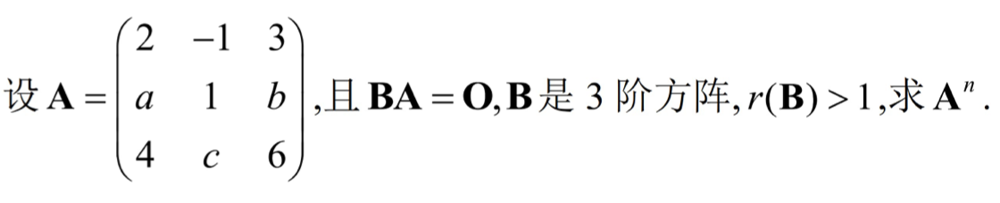\
链接:
[note/D5821C7E-6861-44C3-91E2-C66959399540](marginnote4app://note/D5821C7E-6861-44C3-91E2-C66959399540)\
(2-13 设A=a1p且BA=O,B是3阶方阵,r(B)\>1,求A\". 4c6\

##### 姜晓千真题同源150（重点）  {#姜晓千真题同源150重点-2}

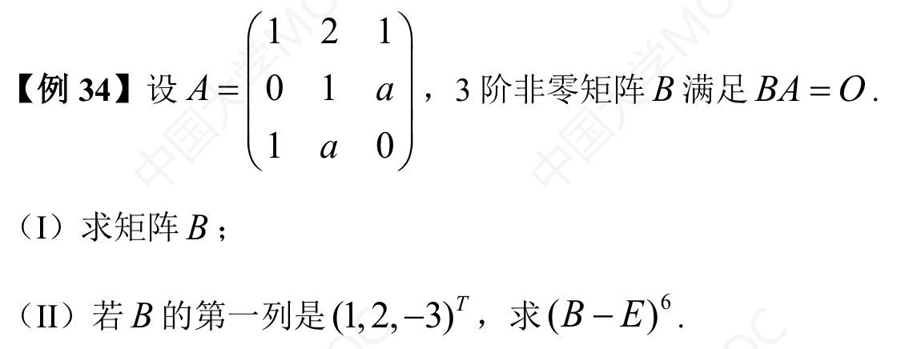\
链接:
[note/9127E1EA-19E8-4CBC-B24B-EAA90A8A69C4](marginnote4app://note/9127E1EA-19E8-4CBC-B24B-EAA90A8A69C4)\
【例 34】设121 01 1 0 A a a =,3 阶非零矩阵 B 满足 BAO=.
(I)求矩阵 B ; (II)若 B 的第一列是(1,2, 3)T−,求6 ( )BE−. OC 中国大学MO OC
中国大学MO\

##### 25版880矩阵基础填空3  {#25版880矩阵基础填空3}

\
链接:
[note/22ACA242-BBDE-4EC1-91CF-A144BA0D0C17](marginnote4app://note/22ACA242-BBDE-4EC1-91CF-A144BA0D0C17)\
(101 设A=020,则A"-\

##### 姜晓千强化例题 

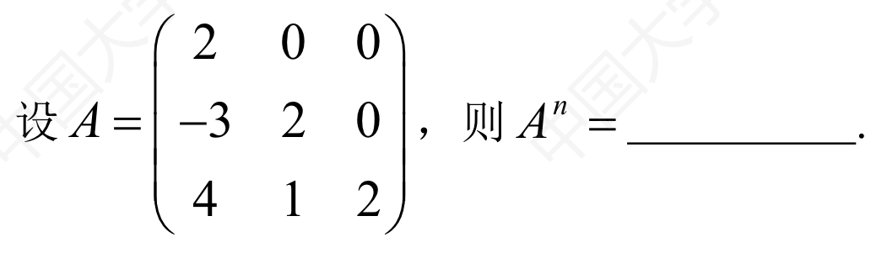\
链接:
[note/82AE30E7-699B-43DA-BB0A-968ED6A51E47](marginnote4app://note/82AE30E7-699B-43DA-BB0A-968ED6A51E47)\
200 设4=-32o则4"12 学\

##### 25版880矩阵综合填空3  {#25版880矩阵综合填空3}

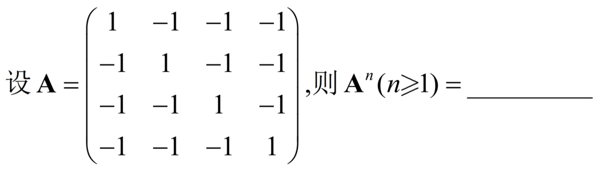\
链接:
[note/54891969-88EB-4C2A-B276-ACC833902F9E](marginnote4app://note/54891969-88EB-4C2A-B276-ACC833902F9E)\
(1-1-1-1 -11-1-1 设A -1-1 1 -1,则A\"(nz)= -1-1-11)\

##### 25版880矩阵综合解答1（选做）  {#25版880矩阵综合解答1选做}

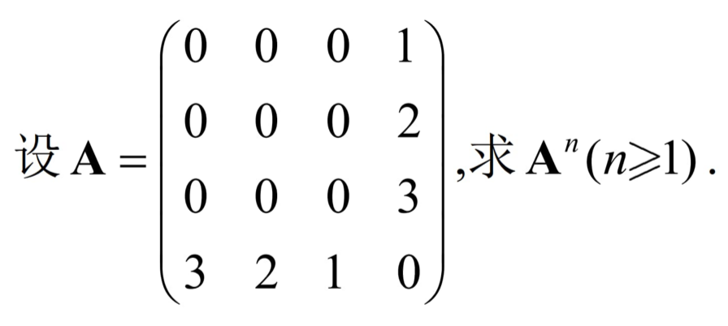\
链接:
[note/F53D7BAC-649A-4BEA-85CC-17916FC85949](marginnote4app://note/F53D7BAC-649A-4BEA-85CC-17916FC85949)\
0001 0002 设A= ,求A\"(nzl). 0003 3210\

##### 25版880矩阵综合解答3（选做）  {#25版880矩阵综合解答3选做}

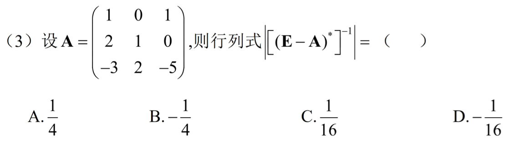\
链接:
[note/FA2AAFBB-5E10-45E4-8211-15146065F833](marginnote4app://note/FA2AAFBB-5E10-45E4-8211-15146065F833)\
010 设A=100,证明:A\"=A\"+A2-E(\>3),并计算A\" 011\

##### 姜晓千真题同源150（重点）  {#姜晓千真题同源150重点-3}

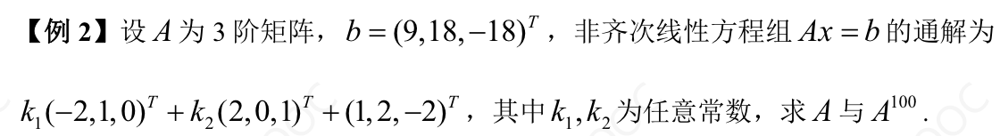\
链接:
[note/75F1E3A6-D216-46C5-8057-6A835572955C](marginnote4app://note/75F1E3A6-D216-46C5-8057-6A835572955C)\
【例 2】设 A 为 3 阶矩阵,(9,18, 18)T b = − ,非齐次线性方程组
Axb=的通解为 1 2 ( 2,1,0) (2,0,1)(1,2, 2) T T T k k −+ +−,其中12,k k
为任意常数,求 A 与100A. C OOC OOC OOC\

##### 姜晓千强化例题 

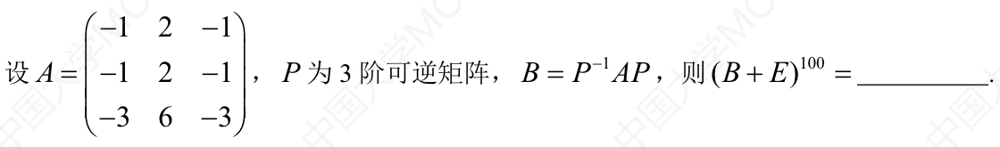\
链接:
[note/8A15CFF1-4BF4-48E2-AC9D-0E0725FA2D55](marginnote4app://note/8A15CFF1-4BF4-48E2-AC9D-0E0725FA2D55)\
-122-1设4=-122-1,P为3阶可逆矩阵,B=P\'AP,则(B+E)\"\--36-3\

##### 900题数二第二章A类14  {#900题数二第二章a类14}

\
链接:
[note/D819A882-8B87-4FF6-82AD-A2B7CA99C651](marginnote4app://note/D819A882-8B87-4FF6-82AD-A2B7CA99C651)\
/0100 0010 14设矩阵A=0001 1000 ,则使得A°=E成立的最小正整数为\

##### 25版880矩阵基础填空4  {#25版880矩阵基础填空4}

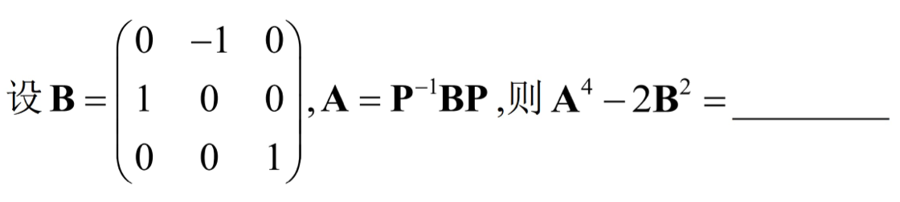\
链接:
[note/99358C6D-ED82-4883-AC8C-A75DAD87FA6D](marginnote4app://note/99358C6D-ED82-4883-AC8C-A75DAD87FA6D)\
/0-10 设B=100,A=PBP,则A-2B2= 001\

##### 姜晓千真题同源150（重点）  {#姜晓千真题同源150重点-4}

\
链接:
[note/623EF77F-39B0-4C9F-BBE8-D0A7700E2FBC](marginnote4app://note/623EF77F-39B0-4C9F-BBE8-D0A7700E2FBC)\
【例 5】设 A 为 2 阶矩阵,则1 ( )EA EA −−=+ 是5AO=的 (A)必要非充分条件
(B)充分非必要条件 (C)充分必要条件 (D)既非充分又非必要条件 OOC 中国OOC
中国\

##### 25版880矩阵基础填空2  {#25版880矩阵基础填空2}

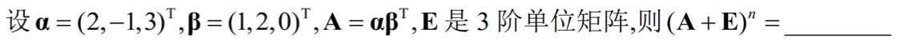\
链接:
[note/19F90D79-B891-4A9A-A3A6-1BA15CDCFA20](marginnote4app://note/19F90D79-B891-4A9A-A3A6-1BA15CDCFA20)\
设u=(2.-1.3),B=(L.2.0)7,A=uB\',E是3阶单位矩阵,则(A+E\"=\

##### 900题数二第二章B类9  {#900题数二第二章b类9}

\
链接:
[note/8D3D0381-29C8-43B8-9418-14088CB57E45](marginnote4app://note/8D3D0381-29C8-43B8-9418-14088CB57E45)\
9设a=(1,0,2)7,B=(4,1,-2)\'记A=aB\",则(E+A)\"=\

##### 900题数二第五章A类17  {#900题数二第五章a类17}

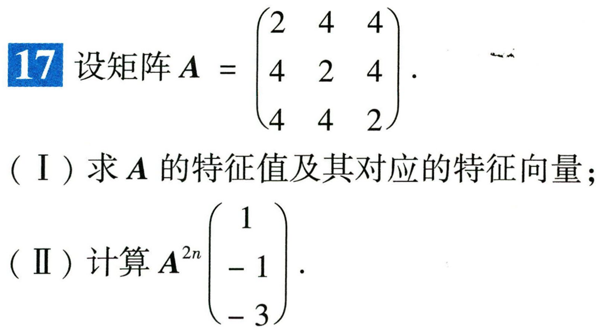\
链接:
[note/942B6969-FE44-4D9E-8985-6973A470BD6C](marginnote4app://note/942B6969-FE44-4D9E-8985-6973A470BD6C)\
(244 17设矩阵A=424 442 (I)求A的特征值及其对应的特征向量; 1) (Ⅱ)计算A"\

##### 25🐙八套数一二三第四套（选做）  {#25🐙八套数一二三第四套选做}

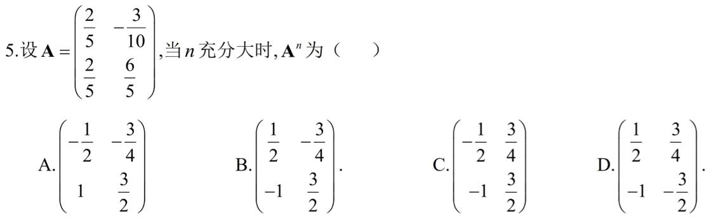\
链接:
[note/D4D58D6D-800D-4E9B-93C2-72C96E6EB206](marginnote4app://note/D4D58D6D-800D-4E9B-93C2-72C96E6EB206)\
(29 510 5.设A= 当n充分大时,A"为() l6o 9 B. (19 (13 O D -1\

#### 初等变换与初等矩阵 

链接:
[note/78A98CF4-7737-4394-92D5-A7C21186FDC1](marginnote4app://note/78A98CF4-7737-4394-92D5-A7C21186FDC1)\
`<html xmlns="http://www.w3.org/1999/xhtml">`{=html}`<head>`{=html}`<meta http-equiv="Content-Type" content="text/html; charset=UTF-8" />`{=html}`</head>`{=html}`<body />`{=html}`</html>`{=html}

##### 1995数一  {#1995数一}

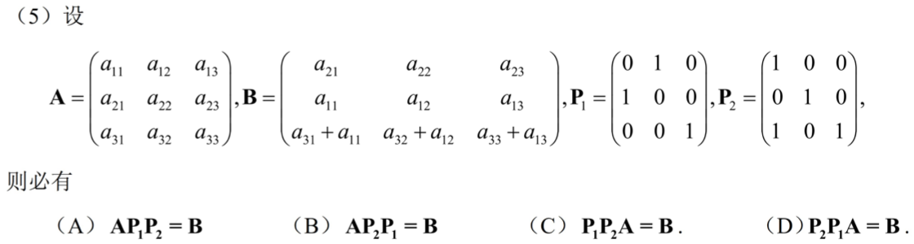\
链接:
[note/D976681B-D788-4D13-95A9-E9235FFF9934](marginnote4app://note/D976681B-D788-4D13-95A9-E9235FFF9934)\
(5)设01012013 a21 022 A=021022023,B=0 02 031032033 /010 /100 013,P=1 0
0,P,=01 0 (431+4n d32+d02 033+43001/1 0 1) 必有则(A) AP,P,=B (B)AP,P=B
(D)PPA=B (C)PP,A=B\

##### 2001数三  {#2001数三-2}

\
链接:
[note/70CA58AB-F35E-4F62-B5F4-F2F80670C5B5](marginnote4app://note/70CA58AB-F35E-4F62-B5F4-F2F80670C5B5)\
a1012 013 014 014 (3)设4=a21422023024 424023422 .B= 431432033034
434033032 041042043044 044 「1 0 0 0 0010 B=0100,其中4可逆,则B等于()
0001 (A) A\'PE (B)PA\'P 0i3 0i2 0i1 「0001 d1 0100 ,B= 09 0010
0430420411000 (C) RRA\'(D) RA\'R\

##### 2004数一二  {#2004数一二-2}

\
链接:
[note/E4E1B57F-7E1B-4705-9580-FD8F2152C743](marginnote4app://note/E4E1B57F-7E1B-4705-9580-FD8F2152C743)\
(11)设A是3阶方阵将A的第1列与第2列交换得B,再把B的第2列加到第3列得C.则满足AQ=C的可逆矩阵Q为()
/010 /010 (A)100 (B)101 10 1 001 /010 /0 1 1 (c)100 (D)10 0 011 001\

##### 2005数一二  {#2005数一二-2}

\
链接:
[note/AFDAF180-48B4-4E0F-8C95-EA85CFEFDD57](marginnote4app://note/AFDAF180-48B4-4E0F-8C95-EA85CFEFDD57)\
【例2.12】(2005,数一、二)设4为m(n22)阶可逆矩阵,交换4的第1行与第2行得到矩阵8,
则【】(A)交换4"的第1列与第2列,得8 (B)交换的第1行与第2行,得B
(C)交换4的第1列与第2列,得-B (D)交换"的第1行与第2行,得-B 中国大学MOOC
中国大学\

##### 900题数二第二章A类6  {#900题数二第二章a类6}

\
链接:
[note/FF7982BD-EBB5-43D1-B9BA-5F3CC74036BB](marginnote4app://note/FF7982BD-EBB5-43D1-B9BA-5F3CC74036BB)\
6设A,B为4阶可逆矩阵,A',B'分别为A,B的伴随矩阵,将A'的第2行乘以3加到第1
行上得矩阵B",则()\

##### 2006数一二三  {#2006数一二三-2}

\
链接:
[note/FC1868C2-33AC-453B-9A15-B8502020E035](marginnote4app://note/FC1868C2-33AC-453B-9A15-B8502020E035)\
(13)设4为3阶矩阵,将4的第2行加到第1行得B,再将B第一列的-1倍加到第2列得C,
/1 1 0 记P=010,则() 001 (A)C=P\'AP (B)C=PAP\' (C) C=PAP (D)C-PAP\

##### 2009数二三  {#2009数二三}

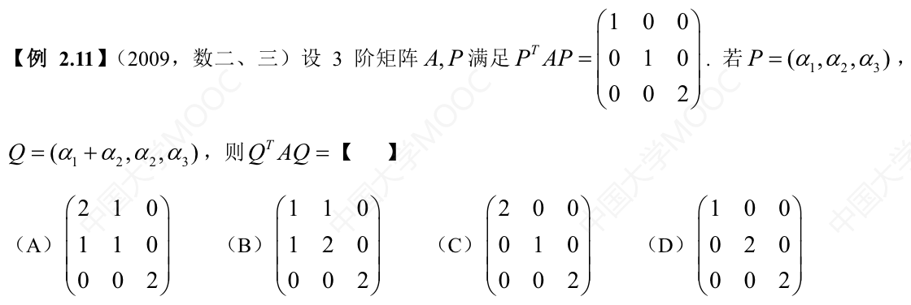\
链接:
[note/4A0E42F1-6E5A-4AF2-8E54-565AD1CFCC02](marginnote4app://note/4A0E42F1-6E5A-4AF2-8E54-565AD1CFCC02)\
2.112009 3 , A P 100 010 002 TP AP . 123 (,,) P 1 223 ( ,,) Q TQ AQ A
210 110 002 B 110 120 002 C 200 010 002 D 100 020 002 中国大学MOOC
中国大学MOOC 中国大学MOOC 中国大学\

##### 2011数一二三  {#2011数一二三}

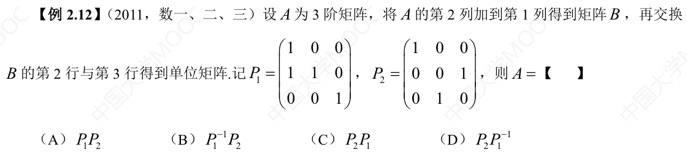\
链接:
[note/633CA242-566F-4877-B741-4825F10EC705](marginnote4app://note/633CA242-566F-4877-B741-4825F10EC705)\
2.122011 A3 A 2 1 B B 2 3 . 1 100 110 001 P 2 100 001 010 P A A 1 2PP B
112 P P C 2 1P P D 1 2 1P P OOC 中国大学MOOC 中国大学MOOC 中国大学MOOC
中国大学M\

##### 2020数一  {#2020数一}

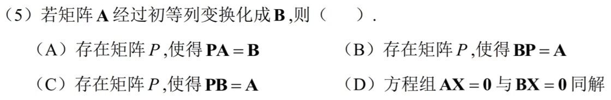\
链接:
[note/A8F92EB3-7C13-40C9-9890-563ED646F1C3](marginnote4app://note/A8F92EB3-7C13-40C9-9890-563ED646F1C3)\
(5)若矩阵A经过初等列变换化成B,则(), (A)存在矩阵P,使得PA=B
(C)存在矩阵P,使得PB=A (B)存在矩阵P,使得BP=A (D)方程组AX=0与BX=0同解\

##### 25🐙八套数一三第七套  {#25🐙八套数一三第七套}

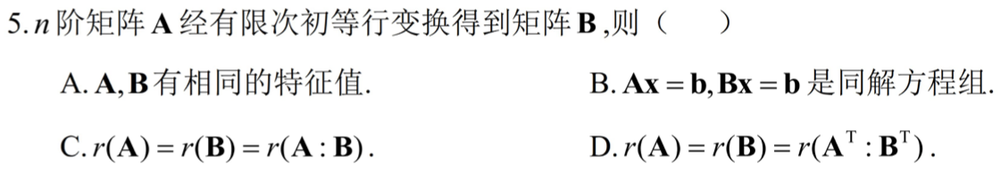\
链接:
[note/64A7D184-D1FD-4F21-9E64-8C755587BA4B](marginnote4app://note/64A7D184-D1FD-4F21-9E64-8C755587BA4B)\
5.n阶矩阵A经有限次初等行变换得到矩阵B,则()
A.A.B有相同的特征值C.r(A)=r(B)=r(A: B) B.Ax=b,Bx=b是同解方程组.
D.r(A)=r(B)=r(A\': B\'). \

##### 2021数二三😅  {#2021数二三😅}

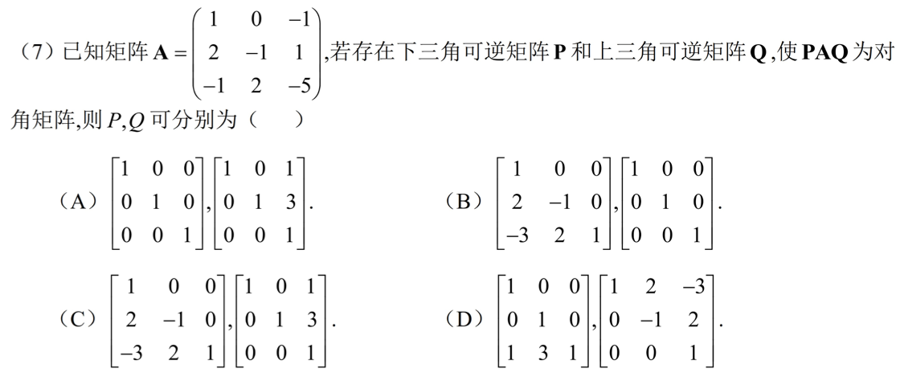\
链接:
[note/1CC8826F-E4CC-45CB-8F17-C19A9086CD71](marginnote4app://note/1CC8826F-E4CC-45CB-8F17-C19A9086CD71)\
/10-I
(7)已知矩阵A=2-11,若存在下三角可逆矩阵P和上三角可逆矩阵Q,使PAQ为对-12
角矩阵,则P,Q可分别为( 1 0 0「1 0 1 (A)0 10,013 001001 「1 0 0「1 0 1\]
(C)2-10,013 -321001 「100「100 (B)2-10,010. -321001 100「1 2-3
(D)010,0-12 131001\

##### 2022数学二三  {#2022数学二三}

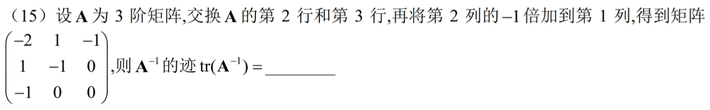\
链接:
[note/BF3C93A0-E113-435C-BEA7-5EF61130FE7A](marginnote4app://note/BF3C93A0-E113-435C-BEA7-5EF61130FE7A)\
(15)
设A为3阶矩阵,交换A的第2行和第3行再将第2列的斗倍加到第1列得到矩阵-21-1
1-10,则A的迹u(A)= -100\

##### 2024数二三  {#2024数二三}

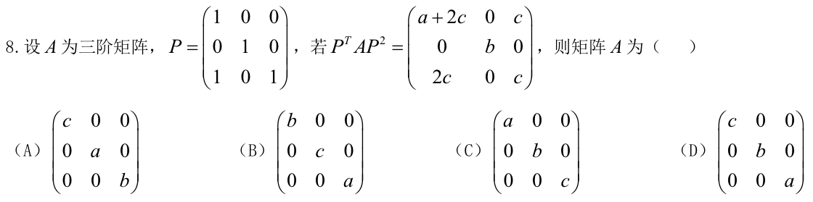\
链接:
[note/472466E2-6913-4FBF-BDA5-019842A52B61](marginnote4app://note/472466E2-6913-4FBF-BDA5-019842A52B61)\
8.设 A 为三阶矩阵,10 0 0 10 10 1 P =,若2 20 0 0 2 0 T ac c P
AP b c c +=,则矩阵 A 为( ) (A)00 0 0 00 c a b  (B)00
0 0 0 0 b c a  (C)0 0 0 0 00 a b c  (D)00 0 0 0 0 c
b a \

##### 25版880矩阵基础选择1  {#25版880矩阵基础选择1}

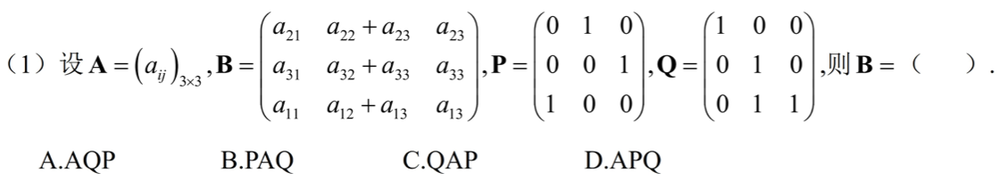\
链接:
[note/5A2DB25D-ACC0-4A63-A183-DC6B38846897](marginnote4app://note/5A2DB25D-ACC0-4A63-A183-DC6B38846897)\
(a21022+d23023 (1)设A=(4),.B=4or@o2+43033 ar412 +013a13) A.AOP B.PAO
C.QAP (010100 ,P=001,Q=010,则B=(). 1 0 0/o1 1 D.APO\

##### 25版880矩阵基础填空12  {#25版880矩阵基础填空12}

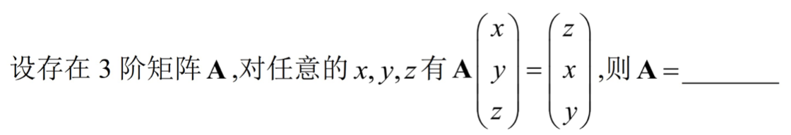\
链接:
[note/ED300B2D-1CA1-4F59-957A-3A2171EBFA11](marginnote4app://note/ED300B2D-1CA1-4F59-957A-3A2171EBFA11)\
\"x 设存在3阶矩阵A,对任意的x,y,z有Ay=x则A=\

##### 25版880矩阵综合选择3  {#25版880矩阵综合选择3}

\
链接:
[note/5113218C-1DB6-4C79-8F29-B34370BA7F8B](marginnote4app://note/5113218C-1DB6-4C79-8F29-B34370BA7F8B)\
am /001 012013 (3)设A=021022023,P=010,且P\"AP"=A,则正整数n,m可以为() 031
032033 100 A.n=m=4 B.n=S,m=4 C.n=4,m=S D.n=m=5\

##### 25版880矩阵综合解答4  {#25版880矩阵综合解答4}

\
链接:
[note/82AF9A1B-E36F-4540-97EB-33A796B0C1F3](marginnote4app://note/82AF9A1B-E36F-4540-97EB-33A796B0C1F3)\
设A=0-2-4. ,证明:A可逆,并将A表示为初等矩阵的乘积-1-1-1\

##### 25版880向量综合解答1  {#25版880向量综合解答1}

\
链接:
[note/B18BB26E-A723-429E-940A-B09ECB2A151C](marginnote4app://note/B18BB26E-A723-429E-940A-B09ECB2A151C)\
1000 (1)设A=1200=(a,u.ay;uq),B=0200. 243-3
(I)求向量组uj,u,us,u,的一个极大线性无关组; (H)求可逆矩阵Ra,Qa,使得P4Q=B
0030\

##### 姜晓千强化例题 

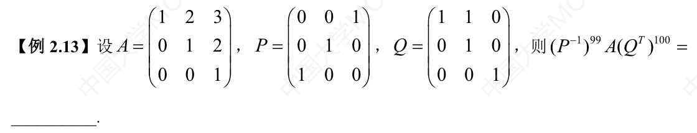\
链接:
[note/D953638D-8D5D-41AC-858E-8D39C1735FD1](marginnote4app://note/D953638D-8D5D-41AC-858E-8D39C1735FD1)\
【例2.13】设4=012,P= 则(P)"4(O7)to0\

#### 分块矩阵 

链接:
[note/9005F57C-F017-46A9-8E34-A3F2CEE39FC1](marginnote4app://note/9005F57C-F017-46A9-8E34-A3F2CEE39FC1)\
`<html xmlns="http://www.w3.org/1999/xhtml">`{=html}`<head>`{=html}`<meta http-equiv="Content-Type" content="text/html; charset=UTF-8" />`{=html}`</head>`{=html}`<body />`{=html}`</html>`{=html}

##### 分块矩阵的逆和伴随 

链接:
[note/DCC98E5C-1D52-4289-A27E-41DE7BC3C045](marginnote4app://note/DCC98E5C-1D52-4289-A27E-41DE7BC3C045)\
`<html xmlns="http://www.w3.org/1999/xhtml">`{=html}`<head>`{=html}`<meta http-equiv="Content-Type" content="text/html; charset=UTF-8" />`{=html}`</head>`{=html}`<body />`{=html}`</html>`{=html}

###### 1991数三  {#1991数三}

\
链接:
[note/758288D6-3A7A-4E70-8A79-ED50EFD0720E](marginnote4app://note/758288D6-3A7A-4E70-8A79-ED50EFD0720E)\
0A) 设4和B为可逆矩阵,X=Bo为分块矩阵,则X\'=\

###### 2009数一二三  {#2009数一二三}

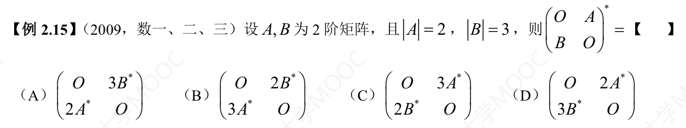\
链接:
[note/558DE9C9-6205-4C71-8B41-67B06539301D](marginnote4app://note/558DE9C9-6205-4C71-8B41-67B06539301D)\
2.152009 , A B2 2A 3B \* OA BO A \* \* 3 2O B AO B \* \* 2 3O B AO C \*
\* 3 2O A BO D \* \* 2 3O A BO 大学MOOC 大学MOOC 大学MOOC 大学M\

###### 25版880矩阵综合填空1😅  {#25版880矩阵综合填空1😅}

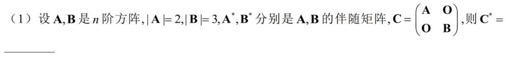\
链接:
[note/67E2B8CB-A181-40DF-9E10-B514A452084A](marginnote4app://note/67E2B8CB-A181-40DF-9E10-B514A452084A)\
AO) (1)设A,B是n阶方阵,\[AF2,lB=3,A,B\'分别是A,B的伴随矩阵,C= ,则c\'-OB\

###### 2023数学二三  {#2023数学二三}

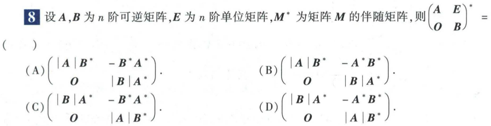\
链接:
[note/7A6CE5FB-88B5-4E1B-8859-459E46C1F6CE](marginnote4app://note/7A6CE5FB-88B5-4E1B-8859-459E46C1F6CE)\
& 设A,B为n阶可逆矩阵为n阶单位矩阵,为矩阵M的伴随矩阵,则4 E O B ) \|A\|
矿O \\B\\A\* J \\B I A \* f \] O I A \|B\* J \* (A) (C) (B) (D) \|4
\|矿O \|B\|A\* O -A*矿 \\B\\A* -48 \*\|4 \|矿\

###### 900题数二第二章B类4  {#900题数二第二章b类4}

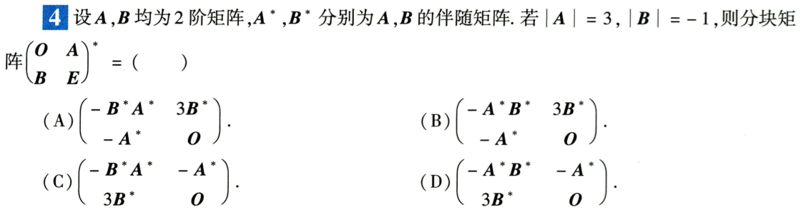\
链接:
[note/C1329B48-E127-43E7-901C-69E027E6F479](marginnote4app://note/C1329B48-E127-43E7-901C-69E027E6F479)\
4设A,B均为2阶矩阵,A\",B\"分别为A,B的伴随矩阵.若\|A\|=3,B\]=-1,则分块矩阵(?)=()
BE(A)/-B\'A1 38-) -A0 -B\'A\'-4\' (c)3B (B)-A\'B*38* -A0) -AB\'-A (D)3B\

###### 姜晓千真题同源150（重点）  {#姜晓千真题同源150重点-5}

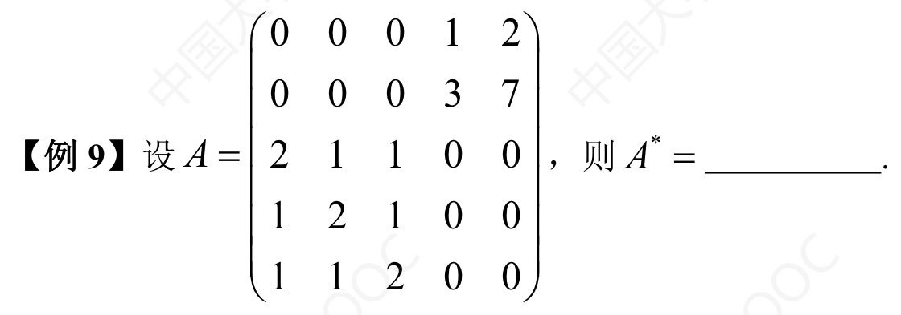\
链接:
[note/408E3289-E863-4267-B7CF-9EB33EBA1DD7](marginnote4app://note/408E3289-E863-4267-B7CF-9EB33EBA1DD7)\
【例 9】设00012 00037 21100 12100 11200 A =,则\*A = .
OOC 中国大OOC 中国大\

##### 分块矩阵秩 

链接:
[note/54F94D2B-B0BD-4989-A696-4F4EA86ABAB1](marginnote4app://note/54F94D2B-B0BD-4989-A696-4F4EA86ABAB1)\
`<html xmlns="http://www.w3.org/1999/xhtml">`{=html}`<head>`{=html}`<meta http-equiv="Content-Type" content="text/html; charset=UTF-8" />`{=html}`</head>`{=html}`<body />`{=html}`</html>`{=html}

###### 2018数一二三  {#2018数一二三}

\
链接:
[note/AFE8A775-12D3-45C6-AE02-7EC2E4E6123E](marginnote4app://note/AFE8A775-12D3-45C6-AE02-7EC2E4E6123E)\
【例2.7】(2018,数一、二、三)设4,B为n阶矩阵,(XY)表示分块矩阵,则【(A)
r(AAB)=r(A) (C) r(4B)=max(r(4),r(B) 1 (B) r(ABA)=r(A) (D) r(AB)=r(A
B\')\

###### 25李永乐六套数一二三第一套  {#25李永乐六套数一二三第一套-2}

\
链接:
[note/B2092AE2-22EC-4F7A-91FD-B913F62BDC6C](marginnote4app://note/B2092AE2-22EC-4F7A-91FD-B913F62BDC6C)\
D. -(AB)\

###### 25🐙八套数一二三第六套  {#25🐙八套数一二三第六套}

\
链接:
[note/08DAAF6F-0BE5-4E1F-A9A3-F67D3A0EB8DC](marginnote4app://note/08DAAF6F-0BE5-4E1F-A9A3-F67D3A0EB8DC)\
7.设A.B为n阶实对称矩阵.则下列结论不成立的是() A.r(A AB)=r(A) BA C.r
=r(AB\') BBA B.r(AB\' AB\'B)=r(AB\'). (ATA D.r =r(A) B\'A\

###### 900题数二第二章B类5  {#900题数二第二章b类5}

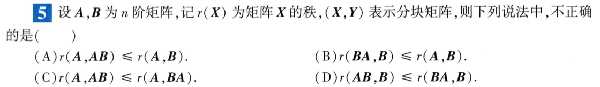\
链接:
[note/8CA0BABA-0A0A-4A18-BFD5-7E56CBA63052](marginnote4app://note/8CA0BABA-0A0A-4A18-BFD5-7E56CBA63052)\
5设A,B为n阶矩阵,记r(X)为矩阵X的秩,(X,Y)表示分块矩阵,则下列说法中,不正确的是()
(A)r(A,AB)sr(A,B). (C)r(A,AB)sr(A,BA). (B)r(BA.B) sr(A.B).
(D)r(AB,B)sr(BA,B)\

###### 2021数一  {#2021数一}

\
链接:
[note/F4998D9C-81AE-45BB-800E-5610C25F9D37](marginnote4app://note/F4998D9C-81AE-45BB-800E-5610C25F9D37)\
【例2.8】(2021,数一)设4,B为n阶矩阵,则下列不成立的是【】(A0 (A) r =2r(A)
(B)r OAA (ABA (C) r -2r(4) oAA AB 2r(4) o 2r(4)\

###### 2023数一  {#2023数一}

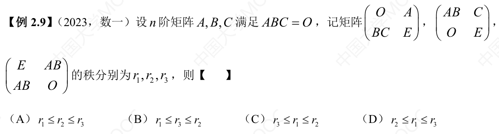\
链接:
[note/4DAD5611-9BDC-48A1-9F53-1F06402064C5](marginnote4app://note/4DAD5611-9BDC-48A1-9F53-1F06402064C5)\
【例2.9】(2023,数一)设n阶矩阵4,B,C满足ABC=O, E AB
的秩分别为,5,乃,则【】AB 0 (A) n≤及≤乃(B) nsnsh 记矩阵)(20 (C) nsnsh (D)
,≤片≤n\

###### 线帒杨强化例题 

\
链接:
[note/12A47874-2961-42CF-80DE-77AA565E063A](marginnote4app://note/12A47874-2961-42CF-80DE-77AA565E063A)\
例 24.设 A,C,D 均是 2×3 矩阵,B 是 4×3 矩阵,X 是 3×3 Y 是 2×4
矩阵,则正确的命题有(A)若 r(A)=r(B)=2,则4BO CAr (B)若
r(A)=1,r(B)=3,则4BO DAr (C)   B A BO AA BB OA r r r r
(D)   B A YBA BO OB AAX r r r r
\

###### 姜晓千真题同源150  {#姜晓千真题同源150-4}

\
链接:
[note/2468E675-CE15-45FD-BBA7-8C423A0751B1](marginnote4app://note/2468E675-CE15-45FD-BBA7-8C423A0751B1)\
【例 6】设 , ,A B C 均为 n 阶矩阵,则( )( ) AC r r Ar B OB = + 是C
的列向量可由 A 的列向量线性表示的 (A)必要非充分条件 (B)充分非必要条件
(C)充分必要条件 (D)既非充分又非必要条件 OOC 中国大学MOOC 中国大学MOOC
中国大学MOOC 中国大学M\

###### 24余丙森五数一二第三套  {#24余丙森五数一二第三套-2}

\
链接:
[note/DF669792-E5F0-4FEE-89A6-1FCD7B6E3781](marginnote4app://note/DF669792-E5F0-4FEE-89A6-1FCD7B6E3781)\
9.设A,B均为n阶矩阵,则下列成立的是(). A.r(A,B)=max(r(A),r(B) B.r=r(AT,BT)
C.r(A,B)=r(A)的充要条件是存在n阶矩阵C,使得B=AC
D.r(A,B)=r(B)的充要条件是存在n阶矩阵D,使得A=DB\

###### 23李林六数三第三套  {#23李林六数三第三套}

\
链接:
[note/0314BE23-8C73-46D5-A69F-093F263CD2A1](marginnote4app://note/0314BE23-8C73-46D5-A69F-093F263CD2A1)\
(10-1 (7)设A=241,B是3阶矩阵,且r(B)=2,r(AB)=1,则下列选项中正确的121 是/A
A.r(I 0)=3. AB Br(O B A0)=3 D.r(0B/ A B\')=3 A C.ro /A° B))=3. ()\

###### 900题数二第二章C类3（选做）  {#900题数二第二章c类3选做}

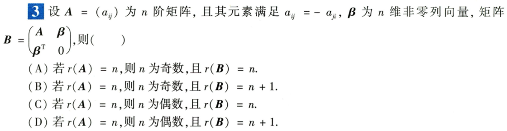\
链接:
[note/1A2E48B2-9D9A-450B-85F6-C567EBBFD718](marginnote4app://note/1A2E48B2-9D9A-450B-85F6-C567EBBFD718)\
3设A=(ag)为n阶矩阵,且其元素满足ag=-ag,B为n维非零列向量,矩阵8=(则\<) B\"0
(A)若r(A)=n,则n为奇数,且r(B)=n (B)若r(A)=n,则n为奇数,且r(B)=n+1
(C)若r(A)=n,则n为偶数,且r(B)=n (D)若r(A)=n,则n为偶数,且(B)=n+1. \

#### AB=🔲  {#ab=🔲}

链接:
[note/DDC45880-678E-4A08-B219-FB60D134E400](marginnote4app://note/DDC45880-678E-4A08-B219-FB60D134E400)\
`<html xmlns="http://www.w3.org/1999/xhtml">`{=html}`<head>`{=html}`<meta http-equiv="Content-Type" content="text/html; charset=UTF-8" />`{=html}`</head>`{=html}`<body />`{=html}`</html>`{=html}

##### AB=E  {#ab=e}

链接:
[note/E42C90A5-B188-4C9F-9735-639ACE9B4A1B](marginnote4app://note/E42C90A5-B188-4C9F-9735-639ACE9B4A1B)\
`<html xmlns="http://www.w3.org/1999/xhtml">`{=html}`<head>`{=html}`<meta http-equiv="Content-Type" content="text/html; charset=UTF-8" />`{=html}`</head>`{=html}`<body />`{=html}`</html>`{=html}

###### 姜晓千强化例题 

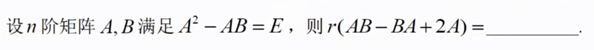\
链接:
[note/2EA960E4-4187-45E8-A4DE-97661D5BC7A2](marginnote4app://note/2EA960E4-4187-45E8-A4DE-97661D5BC7A2)\

###### 1991数一  {#1991数一-2}

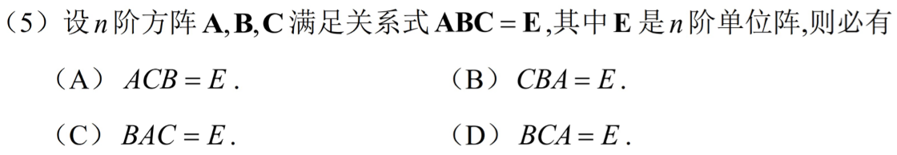\
链接:
[note/03FE2BFE-0EC1-4FDF-9D0B-1A5A7DB7D355](marginnote4app://note/03FE2BFE-0EC1-4FDF-9D0B-1A5A7DB7D355)\
(5)设n阶方阵A,B.C满足关系式ABC=E,其中E是n阶单位阵,则必有(A) ACB=E
(B)CBA=E. (C) BAC=E. (D) BCA=E\

##### AB=O  {#ab=o}

链接:
[note/3E080A40-5B67-4EE7-858A-8952424C43EE](marginnote4app://note/3E080A40-5B67-4EE7-858A-8952424C43EE)\
`<html xmlns="http://www.w3.org/1999/xhtml">`{=html}`<head>`{=html}`<meta http-equiv="Content-Type" content="text/html; charset=UTF-8" />`{=html}`</head>`{=html}`<body />`{=html}`</html>`{=html}

###### 1993数一  {#1993数一}

\
链接:
[note/FE24809E-15DB-4533-B3C9-4BD95D9BEEDA](marginnote4app://note/FE24809E-15DB-4533-B3C9-4BD95D9BEEDA)\
(123 (5)己知Q=241,P为3阶非零矩阵,且满足PQ=0,则() 369 (A)1=6时P的秩必为1.
(C)1≠6时P的秩必为1. (B)7=6时P的秩必为2. (D)1≠6时P的秩必为2. \

###### 1988数三  {#1988数三-4}

\
链接:
[note/B8C11856-95D4-4AA8-AA51-C33779D87549](marginnote4app://note/B8C11856-95D4-4AA8-AA51-C33779D87549)\
若A和B都是n阶非零方阵,且AB=O,则A的秩必小于n. \

###### 1997数一  {#1997数一-2}

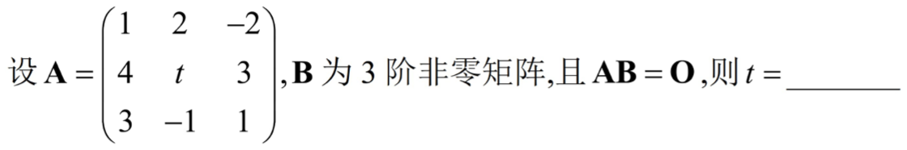\
链接:
[note/8FD2D726-697D-4DBB-BD8C-0AC05E7AD353](marginnote4app://note/8FD2D726-697D-4DBB-BD8C-0AC05E7AD353)\
(12-2 设A=413,B为3阶非零矩阵,且AB=O,则r= 3-11\

###### 1998数三  {#1998数三-2}

\
链接:
[note/E0556A8B-EA8E-492A-80C6-5CD20FC98A42](marginnote4app://note/E0556A8B-EA8E-492A-80C6-5CD20FC98A42)\
2q+为+2g=0,
(3)齐次线性方程组、q+ig+g=0的系数矩阵记为4.若存在三阶矩阵8z0使得为+为+2g=0
4B=0,则() (A)1=-2且\|B=0 (B) 1=-2且\|B≠0 (C)2=1且\]B=0 (D)2=1且\|B+0\

###### 2004数一二  {#2004数一二-3}

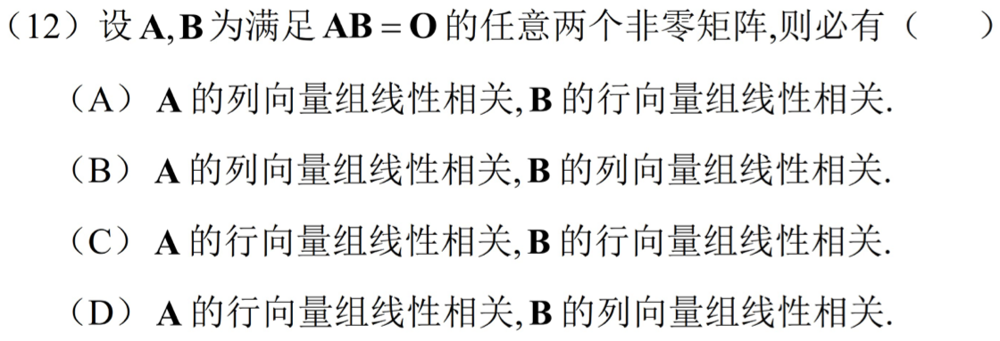\
链接:
[note/53A8D5A3-FF49-495F-AFAD-42159C73FD31](marginnote4app://note/53A8D5A3-FF49-495F-AFAD-42159C73FD31)\
12)设A,B为满足AB=O的任意两个非零矩阵,则必有() (A)
A的列向量组线性相关,B的行向量组线性相关.
(B)A的列向量组线性相关,B的列向量组线性相关(C)A的行向量组线性相关,B的行向量组线性相关,
(D)A的行向量组线性相关,B的列向量组线性相关, (\

###### 25版880矩阵综合选择1  {#25版880矩阵综合选择1}

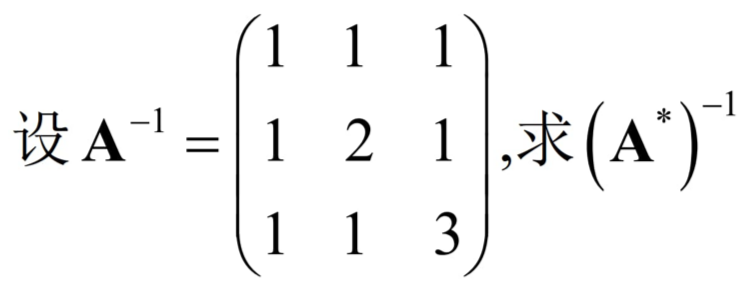\
链接:
[note/664175E9-671E-4B8A-BFAE-D21319CCD0F5](marginnote4app://note/664175E9-671E-4B8A-BFAE-D21319CCD0F5)\
k 1 k+1 1,,B是3阶非零矩阵,且AB=O,则() (k21) A.当k=1时,r(B)=1
C.当r=1时,r(B)=2 B.当k=-3时,r(B)=1 D.当k=-3时,r(B)=2\

###### 2024数二  {#2024数二}

\
链接:
[note/A9253CD4-BB72-41CE-9FC6-A8E149E66F30](marginnote4app://note/A9253CD4-BB72-41CE-9FC6-A8E149E66F30)\
9.设 A 为四阶矩阵, A为 A 的伴随矩阵,若 ( ) A A AO −=,且 AA,则 ( )r A
的可能取值为()(A)0 或 1 (B)1 或 3 (C)2 或 3 (D)1 或 2 \

###### 900题数二第二章A类7  {#900题数二第二章a类7}

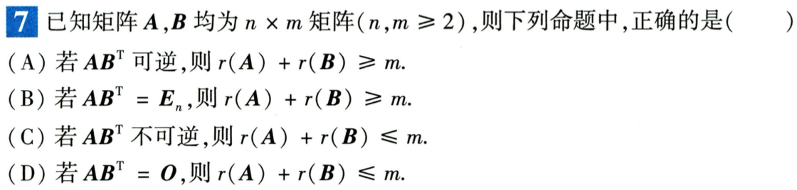\
链接:
[note/DDC725AC-6132-4790-9BE0-69211397DE28](marginnote4app://note/DDC725AC-6132-4790-9BE0-69211397DE28)\
7已知矩阵A,B均为nxm矩阵(n,m≥2),则下列命题中,正确的是()
(A)若AB\'可逆,则r(A)+r(B)≥m. (B)若AB\'=E,,则r(A)+r(B)≥m
(C)若AB\"不可逆,则(A)+r(B)≤m. (D)若AB\'=O,则r(A)+r(B)≤m. \

###### 900题数二第二章A类9  {#900题数二第二章a类9}

\
链接:
[note/36A19FE4-682D-4F45-B046-12DE9AC160AE](marginnote4app://note/36A19FE4-682D-4F45-B046-12DE9AC160AE)\
9设A,B是n阶矩阵,A"是A的伴随矩阵,若r(B)=2,且AB=O,则r(A\")=() (A)0. (B)1.
(C)2. (D)3\

##### AB=C  {#ab=c}

链接:
[note/DD0FF681-0C05-4990-8FAF-2AA3AF1F3959](marginnote4app://note/DD0FF681-0C05-4990-8FAF-2AA3AF1F3959)\
`<html xmlns="http://www.w3.org/1999/xhtml">`{=html}`<head>`{=html}`<meta http-equiv="Content-Type" content="text/html; charset=UTF-8" />`{=html}`</head>`{=html}`<body />`{=html}`</html>`{=html}

###### 2013数一二三  {#2013数一二三-2}

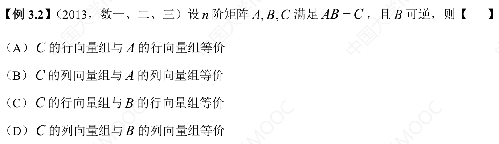\
链接:
[note/0B05D26E-90F8-475C-8ADE-C775DBEA33ED](marginnote4app://note/0B05D26E-90F8-475C-8ADE-C775DBEA33ED)\
3.22013 n , ,A B C ABC B AC A BC A CC B DC B MOOC 中国大学M MOOC
中国大学M MOOC 中国大学M 中\

###### 24余丙森五数一二第四套  {#24余丙森五数一二第四套-2}

\
链接:
[note/A7769E80-D7F4-416B-8A69-72160802B2D6](marginnote4app://note/A7769E80-D7F4-416B-8A69-72160802B2D6)\
8.设矩阵Axa,Bmxs,Cx;满足AC=B,以下命题中正确的是().
A,如果矩阵C的列向量组线性无关,则矩阵B的列向量组一定线性无关B.如果矩阵C的行向量组线性无关,则矩阵B的行向量组一定线性无关C.如果矩阵B的列向量组线性无关,则矩阵C的列向量组一定线性无关D.如果矩阵B的行向量组线性无关,则矩阵C的行向量组一定线性无关\

###### 经典题 

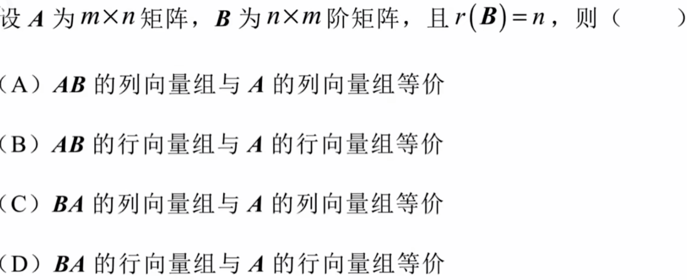\
链接:
[note/EA66B31F-EFE5-4920-8E35-E8DA8E9EEF36](marginnote4app://note/EA66B31F-EFE5-4920-8E35-E8DA8E9EEF36)\

###### 900题数二第三章A类6  {#900题数二第三章a类6}

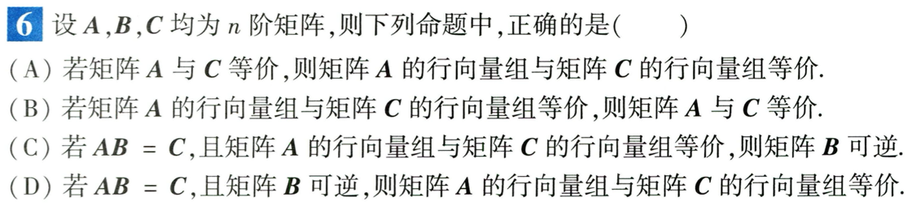\
链接:
[note/2317B4A5-0788-4237-A69F-7F14AAA05E66](marginnote4app://note/2317B4A5-0788-4237-A69F-7F14AAA05E66)\
6设A,B,C均为n阶矩阵,则下列命题中,正确的是()
(A)若矩阵A与C等价,则矩阵A的行向量组与矩阵C的行向量组等价(B)若矩阵A的行向量组与矩阵C的行向量组等价,则矩阵A与C等价(C)若AB=C,且矩阵A的行向量组与矩阵C的行向量组等价,则矩阵B可逆(D)若AB=C,且矩阵B可逆,则矩阵A的行向量组与矩阵C的行向量组等价\

#### 矩阵分解 

链接:
[note/57EC665C-C686-42AE-8293-03278FBFA15F](marginnote4app://note/57EC665C-C686-42AE-8293-03278FBFA15F)\
`<html xmlns="http://www.w3.org/1999/xhtml">`{=html}`<head>`{=html}`<meta http-equiv="Content-Type" content="text/html; charset=UTF-8" />`{=html}`</head>`{=html}`<body />`{=html}`</html>`{=html}

##### 相似对角化矩阵分解 

链接:
[note/F4827D29-AD9F-4B8C-82AE-C84D272DC7C2](marginnote4app://note/F4827D29-AD9F-4B8C-82AE-C84D272DC7C2)\
`<html xmlns="http://www.w3.org/1999/xhtml">`{=html}`<head>`{=html}`<meta http-equiv="Content-Type" content="text/html; charset=UTF-8" />`{=html}`</head>`{=html}`<body />`{=html}`</html>`{=html}

###### 姜晓千真题同源150（选做） 

\
链接:
[note/10EE907D-7E6A-4CEC-9CD4-B0D708204C3E](marginnote4app://note/10EE907D-7E6A-4CEC-9CD4-B0D708204C3E)\
【例 46】设53 3 171 553 A −=−. (I)求nA (II)求矩阵C ,使得3 AC=.
OC 中国大学MOO\

##### 可逆矩阵QR分解 

链接:
[note/692F898B-F862-447B-98A3-54AB65E8DB30](marginnote4app://note/692F898B-F862-447B-98A3-54AB65E8DB30)\
`<html xmlns="http://www.w3.org/1999/xhtml">`{=html}`<head>`{=html}`<meta http-equiv="Content-Type" content="text/html; charset=UTF-8" />`{=html}`</head>`{=html}`<body />`{=html}`</html>`{=html}

###### 姜晓千真题同源150（选做）  {#姜晓千真题同源150选做-2}

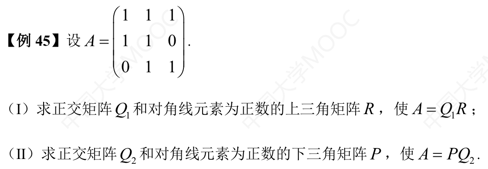\
链接:
[note/74660235-3385-4CFE-99DF-CCADEF270016](marginnote4app://note/74660235-3385-4CFE-99DF-CCADEF270016)\
【例 45】设1 1 1 1 1 0 0 1 1 A =. (I)求正交矩阵1Q
和对角线元素为正数的上三角矩阵 R ,使1 AQ R= ;(II)求正交矩阵2Q
和对角线元素为正数的下三角矩阵 P ,使2 APQ= . 中国大学MOOC 中国大学MOOC
中国大学M\

##### 实对称矩阵分解 

链接:
[note/4958AFFA-7599-4035-94C5-F726649EFA09](marginnote4app://note/4958AFFA-7599-4035-94C5-F726649EFA09)\
`<html xmlns="http://www.w3.org/1999/xhtml">`{=html}`<head>`{=html}`<meta http-equiv="Content-Type" content="text/html; charset=UTF-8" />`{=html}`</head>`{=html}`<body />`{=html}`</html>`{=html}

###### 姜晓千真题同源150（选做）  {#姜晓千真题同源150选做-3}

\
链接:
[note/1064D798-0423-4476-BA2F-37223972504E](marginnote4app://note/1064D798-0423-4476-BA2F-37223972504E)\
【例 47】设53 3 353 335 A −=−. (I)求nA (II)求矩阵C ,使得3 AC=.
中国大学MOOC 中\

##### 正定矩阵的分解 

链接:
[note/151D9E45-4617-44E8-8A24-3E6DEFA15F55](marginnote4app://note/151D9E45-4617-44E8-8A24-3E6DEFA15F55)\
`<html xmlns="http://www.w3.org/1999/xhtml">`{=html}`<head>`{=html}`<meta http-equiv="Content-Type" content="text/html; charset=UTF-8" />`{=html}`</head>`{=html}`<body />`{=html}`</html>`{=html}

###### 姜晓千真题同源150  {#姜晓千真题同源150-5}

\
链接:
[note/6FF6A708-CA59-4F79-A22D-5E70F8524274](marginnote4app://note/6FF6A708-CA59-4F79-A22D-5E70F8524274)\
【例 58】设2024 2 172 4220 A −=−−−,判定 A
是否正定,并求正定矩阵 B ,使得2BA=. 中国大学MO 中国大学MO 中国大学MO\

###### 2021数一  {#2021数一-2}

\
链接:
[note/D75FFCEA-6B1E-4151-B125-D4693A0C756C](marginnote4app://note/D75FFCEA-6B1E-4151-B125-D4693A0C756C)\
【2021,数一】设11 1 1 11 a A a a −= −−−. (I)求正交矩阵 P
,使得TP AP 为对角矩阵; (II)求正定矩阵C ,使得2(3) CaEA = +−. C OOC
中国大学MO 中国大学M\

###### 900题数二第六章B类7（重点）  {#900题数二第六章b类7重点}

\
链接:
[note/0B303C0A-8866-4EAB-BD30-64F52EB59F21](marginnote4app://note/0B303C0A-8866-4EAB-BD30-64F52EB59F21)\
了已知矩阵A。("',正定矩阵C满足碎=(a+2)E-A,则C的所有元素之和\\1 a 为\

###### 23李林六数一第一套  {#23李林六数一第一套}

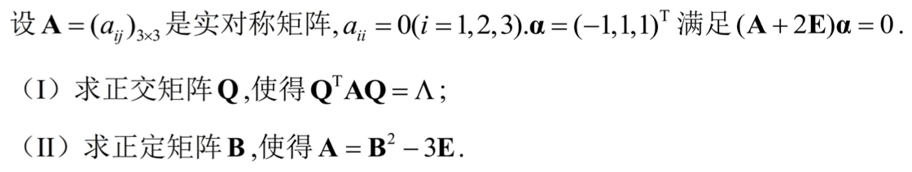\
链接:
[note/4428FDEF-D4EA-431E-A160-02548C87FD85](marginnote4app://note/4428FDEF-D4EA-431E-A160-02548C87FD85)\
设A=(ag)sa是实对称矩阵,a,=0(i=12,3).u=(-L,L1)7满足(A+2E)u=0
(1)求正交矩阵Q,使得Q\'AQ=A; (I)求正定矩阵B,使得A=B-3E. \

###### 25版880二次型综合解答9  {#25版880二次型综合解答9}

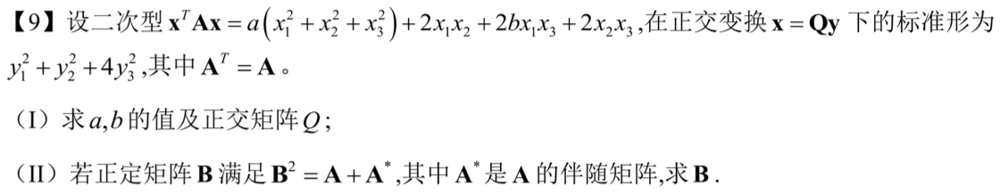\
链接:
[note/7D8C2E13-F149-4011-9F89-326E1966F5CB](marginnote4app://note/7D8C2E13-F149-4011-9F89-326E1966F5CB)\
【9】设二次型xYAx=alj+对+对)+2xg+2hxy+2xy,在正交变换x=Qy下的标准形为片+巧+4巧,其中A'=A。
(I)求a.b的值及正交矩阵Q;
(Ⅱ)若正定矩阵B满足BF=A+A",其中A"是A的伴随矩阵,求B. \

#### 其他题型 

链接:
[note/E511E2F8-745A-40EF-A60F-82D94176B290](marginnote4app://note/E511E2F8-745A-40EF-A60F-82D94176B290)\
`<html xmlns="http://www.w3.org/1999/xhtml">`{=html}`<head>`{=html}`<meta http-equiv="Content-Type" content="text/html; charset=UTF-8" />`{=html}`</head>`{=html}`<body />`{=html}`</html>`{=html}

##### 求各行（列）元素之和 

链接:
[note/CA27CE4E-51B5-4E98-857B-7CD4E52C8884](marginnote4app://note/CA27CE4E-51B5-4E98-857B-7CD4E52C8884)\
`<html xmlns="http://www.w3.org/1999/xhtml">`{=html}`<head>`{=html}`<meta http-equiv="Content-Type" content="text/html; charset=UTF-8" />`{=html}`</head>`{=html}`<body />`{=html}`</html>`{=html}

###### 25版880矩阵综合填空2  {#25版880矩阵综合填空2}

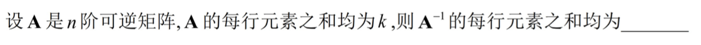\
链接:
[note/DEF31D0D-055B-4417-B351-6F952CBD40A8](marginnote4app://note/DEF31D0D-055B-4417-B351-6F952CBD40A8)\
设A是n阶可逆矩阵,A的每行元素之和均为k,则A的每行元素之和均为\

###### 姜晓千强化例题 

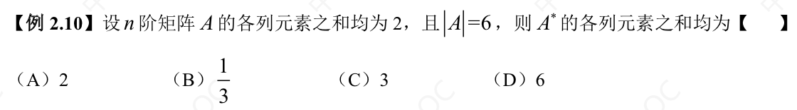\
链接:
[note/DBAB6952-9D24-4B99-B41E-FAB7E7288500](marginnote4app://note/DBAB6952-9D24-4B99-B41E-FAB7E7288500)\
【例2.10】设n阶矩阵4的各列元素之和均为2,且4=6,则矿的各列元素之和均为【(A)
2 (B)1 (C)3 O OC (D)6 OO\

###### 900题数二第五章B类12（重点）  {#900题数二第五章b类12重点}

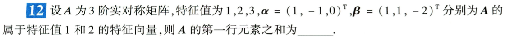\
链接:
[note/613F4ABD-3F33-4D43-9719-8825BD1D2B9E](marginnote4app://note/613F4ABD-3F33-4D43-9719-8825BD1D2B9E)\
12设A为3阶实对称矩阵,特征值为1,2,3,@=(1,-1,0),B=(1,1,-2)\'分别为A的属于特征值1和2的特征向量,则A的第一行元素之和为\

##### 矩阵等价 

链接:
[note/9331E7B6-BAC1-47FD-8D0A-C49E30D9C0C4](marginnote4app://note/9331E7B6-BAC1-47FD-8D0A-C49E30D9C0C4)\
`<html xmlns="http://www.w3.org/1999/xhtml">`{=html}`<head>`{=html}`<meta http-equiv="Content-Type" content="text/html; charset=UTF-8" />`{=html}`</head>`{=html}`<body />`{=html}`</html>`{=html}

###### 1997数三  {#1997数三-2}

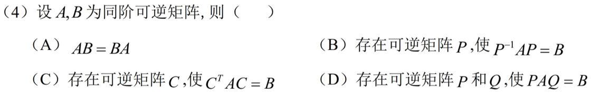\
链接:
[note/012C8566-3876-4D48-955D-E4FC8EB99619](marginnote4app://note/012C8566-3876-4D48-955D-E4FC8EB99619)\
(4)设4B为同阶可逆矩阵,则() (A)AB=BA (C)存在可逆矩阵C,使C\'AC=B
(B)存在可逆矩阵P,使P\'AP=B D)存在可逆矩阵P和Q,使PAQ=B (\

###### 2004数三  {#2004数三}

\
链接:
[note/AB3EB602-8C74-4F3D-97C6-45C0787EC4E4](marginnote4app://note/AB3EB602-8C74-4F3D-97C6-45C0787EC4E4)\
2.132004 n AB A (0) Aa a Ba B (0) Aa a Ba C 0A 0B D 0A 0B 中国大学MOOC
中国大学MOOC 中国大学MOO\

###### 2016数二  {#2016数二}

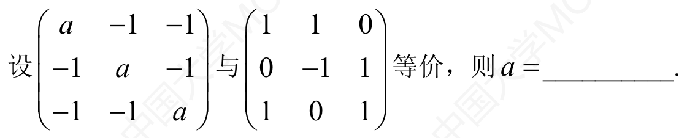\
链接:
[note/9CE2F226-65CB-4B13-871B-76BE6F04C361](marginnote4app://note/9CE2F226-65CB-4B13-871B-76BE6F04C361)\
11 1 1 11 a a a 110 01 1 101 a**\_\_**. 中国大学MO 中国大学MO\

###### 25版880矩阵基础选择4  {#25版880矩阵基础选择4}

\
链接:
[note/ABF591F2-D9E7-4256-8DC2-15F07FEB4D6B](marginnote4app://note/ABF591F2-D9E7-4256-8DC2-15F07FEB4D6B)\
11 /111 010 01-1 (4)设矩阵A= 与B= )k3 23k k-1 5 1 351 A.k=1 B.人≠1
C.k=-1 等价,则() D.k≠-1\

###### 900题数二第二章A类1  {#900题数二第二章a类1}

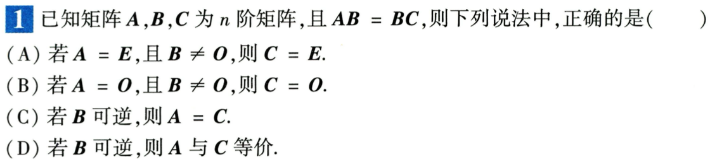\
链接:
[note/D2008E48-682A-4B36-A6FC-E18665A99468](marginnote4app://note/D2008E48-682A-4B36-A6FC-E18665A99468)\
丁已知矩阵A,B,C为n阶矩阵,且AB=BC,则下列说法中,正确的是()
(A)若A=E,且B≠O,则C=E (B)若A=O,且B≠O,则C=0. (C)若B可逆,则A=C.
(D)若B可逆,则A与C等价. \

###### 900题数二第二章A类2  {#900题数二第二章a类2}

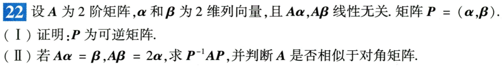\
链接:
[note/31B0D899-4798-466C-B236-A1E539E75930](marginnote4app://note/31B0D899-4798-466C-B236-A1E539E75930)\
/102 2下列矩阵中,与A=213等价的是( 3243 (2022 /1000 (A)2023. (B)010 2024
0001 0010 /101 1 (C)0101 (D)2022 1010 3033\

##### 已知AB求BA 

链接:
[note/D972665B-ADB9-4267-BD06-202826BDBE79](marginnote4app://note/D972665B-ADB9-4267-BD06-202826BDBE79)\
`<html xmlns="http://www.w3.org/1999/xhtml">`{=html}`<head>`{=html}`<meta http-equiv="Content-Type" content="text/html; charset=UTF-8" />`{=html}`</head>`{=html}`<body />`{=html}`</html>`{=html}

###### 姜晓千真题同源150（选做）  {#姜晓千真题同源150选做-4}

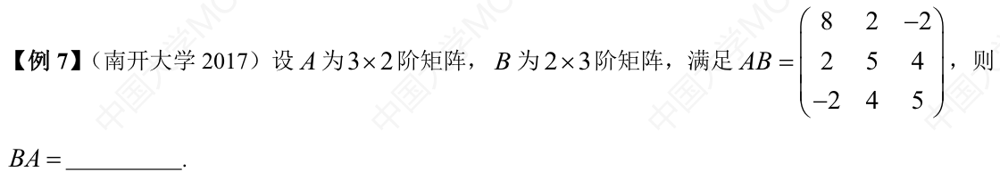\
链接:
[note/5F1460CD-8ED0-4566-BFE1-8DD394FFB5D4](marginnote4app://note/5F1460CD-8ED0-4566-BFE1-8DD394FFB5D4)\
【例 7】 (南开大学 2017)设 A 为3 2× 阶矩阵, B 为 2 3× 阶矩阵,满足822 254
245 AB −=−,则 BA = . 中国大学MO 中国大学MO 中国大学MO
中国大学\

###### 姜晓千真题同源150（选做）  {#姜晓千真题同源150选做-5}

\
链接:
[note/DD6F3D91-E4AC-442F-B9F1-5918D9D76269](marginnote4app://note/DD6F3D91-E4AC-442F-B9F1-5918D9D76269)\
(全国大学生 2012 年竞赛题) 设 , A B 分别为3 2,2 3 ××阶矩阵, 满足804 3 96
2201 AB −=−−−, 求 BA . OOC 中国OOC 中国OOC 中国中国\

###### 姜晓千真题同源150（选做）  {#姜晓千真题同源150选做-6}

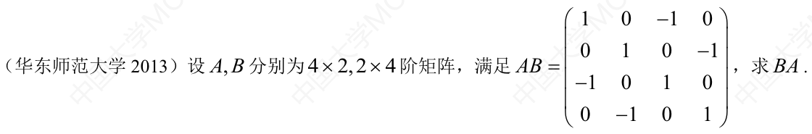\
链接:
[note/FFF0A7FF-467F-4D58-B30B-71637F00A6C8](marginnote4app://note/FFF0A7FF-467F-4D58-B30B-71637F00A6C8)\
(华东师范大学 2013)设 , A B 分别为 4 2,2 4 ××阶矩阵,满足1010 0101 1010
0101 AB −−=−−,求 BA . 中国大学MO 中国大学MO 中国大学MO
中国大学\

###### 900题数二第二章C类7（选做）  {#900题数二第二章c类7选做}

\
链接:
[note/536761A3-620B-4C2F-AC9B-A16F3BF57AC1](marginnote4app://note/536761A3-620B-4C2F-AC9B-A16F3BF57AC1)\
/10-10 0 o-1 2设矩阵A为4x2矩阵,B为2x4矩阵,且满足AB= =((A)/1 0) (B)/2 o)
0 3/ 02 ,则BA -10 0 -10 1c)/40) (D)由已知条件不能确定. 00\

###### 25🐙八套数一二三第六套（选做）  {#25🐙八套数一二三第六套选做}

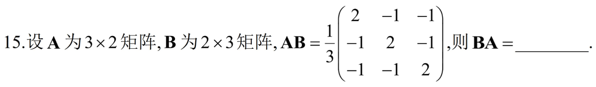\
链接:
[note/1F687D83-D077-457E-9088-3B0E14A1C44F](marginnote4app://note/1F687D83-D077-457E-9088-3B0E14A1C44F)\
15.设A为3x2矩阵,B为2x3矩阵,AB= (2-1-1 -12-1,则BA= -1-12\

##### 矩阵化E 

链接:
[note/6BD1FADA-C114-4D2F-97A0-2A28A5787FCD](marginnote4app://note/6BD1FADA-C114-4D2F-97A0-2A28A5787FCD)\
`<html xmlns="http://www.w3.org/1999/xhtml">`{=html}`<head>`{=html}`<meta http-equiv="Content-Type" content="text/html; charset=UTF-8" />`{=html}`</head>`{=html}`<body />`{=html}`</html>`{=html}

###### 1995数三  {#1995数三-3}

\
链接:
[note/D80BDD0E-081C-4E89-A61A-1DAE1876700A](marginnote4app://note/D80BDD0E-081C-4E89-A61A-1DAE1876700A)\
(3)设矩阵4。的秩为r(A)=m\<n,E为m阶单位矩阵,下述结论中正确的是()
(A)4的任意m个行向量必线性无关(B)4的任意一个m阶子式不等于零(C)若矩阵B满足B4=0,则B=0
(D)4通过初等行变换,必可以化为(E。,0)的形式\

###### 24汤家凤五数一二三第一套  {#24汤家凤五数一二三第一套}

\
链接:
[note/A74FD840-5420-45C7-B941-7B98FFD8D507](marginnote4app://note/A74FD840-5420-45C7-B941-7B98FFD8D507)\
7.下列结论正确的是(). A.r(A: BA)=r(A)
B.设A为mXn矩阵,且r(A)=m\<n,则存在可逆矩阵P,使得PA=(EiO)
己设A为eXe每游s用rA)一w长n用有在可理划师必,独海心一同D.设A为mXn矩阵,且r(A)=m\<n,则存在可逆矩阵B,使得AA十E=B\

###### 23🐙八套数一二三第二套  {#23🐙八套数一二三第二套}

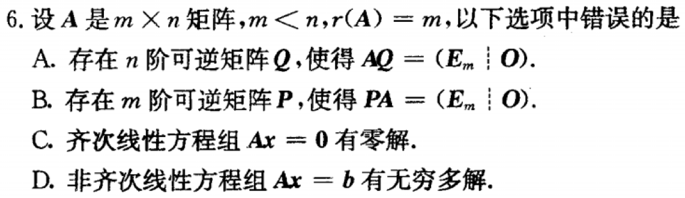\
链接:
[note/7DA2F03D-A7A8-40AE-8652-C9699006AB37](marginnote4app://note/7DA2F03D-A7A8-40AE-8652-C9699006AB37)\
6.设A是mXn矩阵,m\<n,r(A)=m,以下选项中错误的是A.存在n阶可逆矩阵2,使得A4Q=(E,i0).
B.存在m阶可逆矩阵P,使得PM=(E。O).
C.齐次线性方程组Ar=0有零解D.非齐次线性方程组Ar=6有无穷多解\

###### 900题数二第二章B类1  {#900题数二第二章b类1}

\
链接:
[note/23CA1529-F9C6-4FD7-8DB5-8CD73A63D72C](marginnote4app://note/23CA1529-F9C6-4FD7-8DB5-8CD73A63D72C)\
1设A为mxn矩阵,r(A)=m,则下列说法中,正确的是() 1若P为m阶矩阵,且PA=A,则P=E.
2若P为n阶矩阵,且AP=A,则P=E 33A能通过一系列初等行变换化为形式(E。,0)
4A能通过一系列初等列变换化为形式(E。,0) (A)13(B)144()28 (D)24\

##### AB=BA  {#ab=ba}

链接:
[note/B0AC986F-1CCC-4B52-ADB8-9439F339A1D7](marginnote4app://note/B0AC986F-1CCC-4B52-ADB8-9439F339A1D7)\
`<html xmlns="http://www.w3.org/1999/xhtml">`{=html}`<head>`{=html}`<meta http-equiv="Content-Type" content="text/html; charset=UTF-8" />`{=html}`</head>`{=html}`<body />`{=html}`</html>`{=html}

###### 25版880矩阵基础解答8  {#25版880矩阵基础解答8}

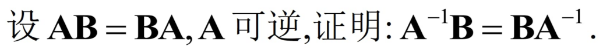\
链接:
[note/0FAFFAE8-EA15-4B63-9F19-7C968F07039C](marginnote4app://note/0FAFFAE8-EA15-4B63-9F19-7C968F07039C)\
设AB=BA.A可逆.证明:A\'B-BA\'. \

###### 25版880矩阵基础解答9  {#25版880矩阵基础解答9}

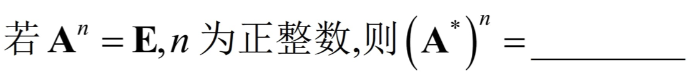\
链接:
[note/5AF97610-5D5F-4CA1-84D0-98D26FEFEA2D](marginnote4app://note/5AF97610-5D5F-4CA1-84D0-98D26FEFEA2D)\
设A.B都是n阶方阵,且AF=A.BF=B.(A+BF=A+B.证明:AB=BA\

###### 900题数二第六章B类5  {#900题数二第六章b类5}

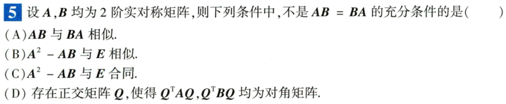\
链接:
[note/29C4E980-8CC5-42C4-914F-95ADDB2213C6](marginnote4app://note/29C4E980-8CC5-42C4-914F-95ADDB2213C6)\
5设A,B均为2阶实对称矩阵,则下列条件中,不是AB=BA的充分条件的是(
(A)AB与BA相似以(B)A2-AB与E相似(C)A2-AB与E合同)
(D)存在正交矩阵Q,使得Q\'AQ,Q\'BQ均为对角矩阵\

##### 正交矩阵 

链接:
[note/4FA40A50-01F2-439F-A042-3BC41EF5D554](marginnote4app://note/4FA40A50-01F2-439F-A042-3BC41EF5D554)\
`<html xmlns="http://www.w3.org/1999/xhtml">`{=html}`<head>`{=html}`<meta http-equiv="Content-Type" content="text/html; charset=UTF-8" />`{=html}`</head>`{=html}`<body />`{=html}`</html>`{=html}

###### 25版880矩阵拓展2（选做）  {#25版880矩阵拓展2选做}

\
链接:
[note/EE56DB13-424E-4411-B895-FA018788A4AF](marginnote4app://note/EE56DB13-424E-4411-B895-FA018788A4AF)\
(2)设分块矩阵P=OBA"为正交矩阵,A.B分别是m阶和n阶方阵,证明:A与B是正交矩的\

###### 900题数二第五章C类1（选做）  {#900题数二第五章c类1选做}

\
链接:
[note/FDF454C6-F095-4F30-8E2B-38E866BB1082](marginnote4app://note/FDF454C6-F095-4F30-8E2B-38E866BB1082)\
1若矩阵A,B为n阶正交矩阵,则下列命题中,正确命题的个数为() 1A=+1.
(2若A存在实特征值,则必为±1. 3AB也是正交矩阵4若A=-B,则A+B必不可逆(A)1.
(B)2. (C)3. (D)4. \

###### 900题数二第三章B类7（选做）  {#900题数二第三章b类7选做}

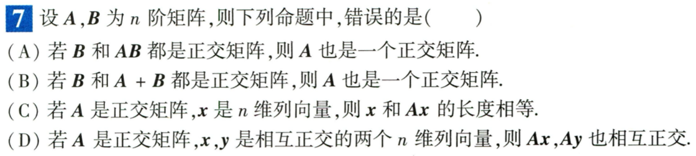\
链接:
[note/8DFF809D-3BE1-4393-84C5-556924334C97](marginnote4app://note/8DFF809D-3BE1-4393-84C5-556924334C97)\
7设A,B为n阶矩阵,则下列命题中,错误的是()
(A)若B和AB都是正交矩阵,则A也是一个正交矩阵.
(B)若B和A+B都是正交矩阵,则A也是一个正交矩阵(C)若A是正交矩阵,x是n维列向量,则x和Ax的长度相等(D)若A是正交矩阵,x,y是相互正交的两个n维列向量,则Ax,Ay也相互正交\

##### 给出矩阵等式推导相关结论 

链接:
[note/7F9352C0-0681-4EBF-A323-E1FC70643212](marginnote4app://note/7F9352C0-0681-4EBF-A323-E1FC70643212)\
`<html xmlns="http://www.w3.org/1999/xhtml">`{=html}`<head>`{=html}`<meta http-equiv="Content-Type" content="text/html; charset=UTF-8" />`{=html}`</head>`{=html}`<body />`{=html}`</html>`{=html}

###### 900题数二第五章B类8  {#900题数二第五章b类8}

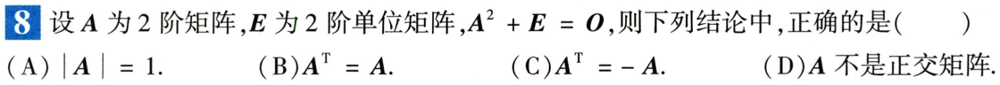\
链接:
[note/ABFCA7FA-5B34-4D08-8494-396FCF6E3F1B](marginnote4app://note/ABFCA7FA-5B34-4D08-8494-396FCF6E3F1B)\
8设4为2阶矩阵,E为2阶单位矩阵,A°+E=O,则下列结论中,正确的是( (A)\|A=1.
(B)AT=A. ) (C)A\'\--A. (D)A不是正交矩阵\

###### 25🐙八套数一第八套; 数二第三套; 数三第六套  {#25🐙八套数一第八套-数二第三套-数三第六套}

\
链接:
[note/BF66D017-D9A6-4C7D-9552-9CEECFCBF6CD](marginnote4app://note/BF66D017-D9A6-4C7D-9552-9CEECFCBF6CD)\
=E.α为3维纠同量.B=AA\'r MIlD下结论:\

##### 反对称矩阵 

链接:
[note/CA4C5BEF-4CC9-4715-93BC-8B8066A19C15](marginnote4app://note/CA4C5BEF-4CC9-4715-93BC-8B8066A19C15)\
`<html xmlns="http://www.w3.org/1999/xhtml">`{=html}`<head>`{=html}`<meta http-equiv="Content-Type" content="text/html; charset=UTF-8" />`{=html}`</head>`{=html}`<body />`{=html}`</html>`{=html}

###### 姜晓千基础例题  {#姜晓千基础例题-16}

\
链接:
[note/8EA3C57C-CC22-4596-87F3-F2575EC3F333](marginnote4app://note/8EA3C57C-CC22-4596-87F3-F2575EC3F333)\
2.2 , A Bn AAB BkA C TA DAB ABBA MOOC 中MOOC 中MOOC 中\

##### 直接考察秩为一 

链接:
[note/4CEB8872-6A70-4493-A3C1-4A752BECC5CB](marginnote4app://note/4CEB8872-6A70-4493-A3C1-4A752BECC5CB)\
`<html xmlns="http://www.w3.org/1999/xhtml">`{=html}`<head>`{=html}`<meta http-equiv="Content-Type" content="text/html; charset=UTF-8" />`{=html}`</head>`{=html}`<body />`{=html}`</html>`{=html}

###### 2003数二  {#2003数二}

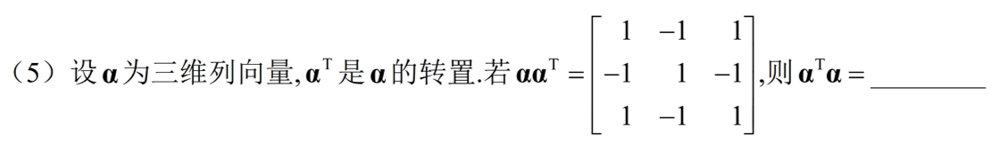\
链接:
[note/4CAAA588-E1D3-4EF7-A343-BE27E85F0EA7](marginnote4app://note/4CAAA588-E1D3-4EF7-A343-BE27E85F0EA7)\
「1-11 (5)设u为三维列向量,u\'是u的转置.若uu=-11-1,则u0= 1-11\

##### 简单性质考察 

链接:
[note/A6C82A8F-94F7-414E-B27E-7370512CC61C](marginnote4app://note/A6C82A8F-94F7-414E-B27E-7370512CC61C)\
`<html xmlns="http://www.w3.org/1999/xhtml">`{=html}`<head>`{=html}`<meta http-equiv="Content-Type" content="text/html; charset=UTF-8" />`{=html}`</head>`{=html}`<body />`{=html}`</html>`{=html}

###### 1989数一三  {#1989数一三}

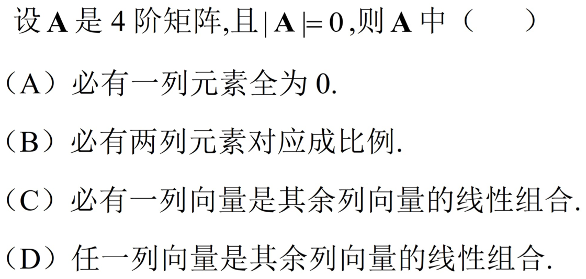\
链接:
[note/62D5219E-69F9-4801-81DA-103EB068EE7E](marginnote4app://note/62D5219E-69F9-4801-81DA-103EB068EE7E)\
设A是4阶矩阵.且IA=0.则A中() (A)必有一列元素全为0
(B)必有两列元素对应成比例(C)必有一列向量是其余列向量的线性组合(D)任一列向量是其余列向量的线性组合\

###### 1989数三  {#1989数三}

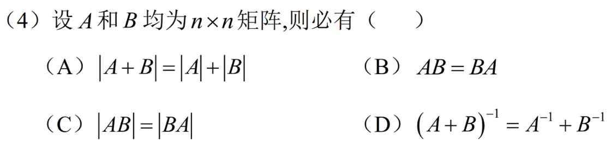\
链接:
[note/C5DB9EE1-FBF9-482F-AC68-0223B36CA2DB](marginnote4app://note/C5DB9EE1-FBF9-482F-AC68-0223B36CA2DB)\
(4)设4和B均为nxn矩阵,则必有() (A)4+B=4+8 (B)AB=BA (C)AB=BA
(D)(A+B)\'=A\'+B\
